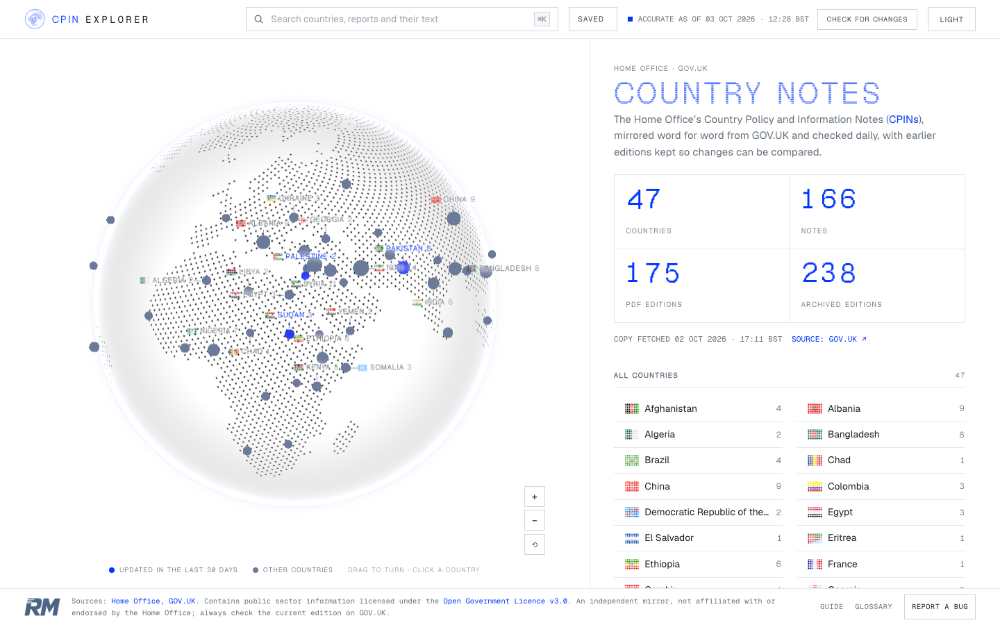
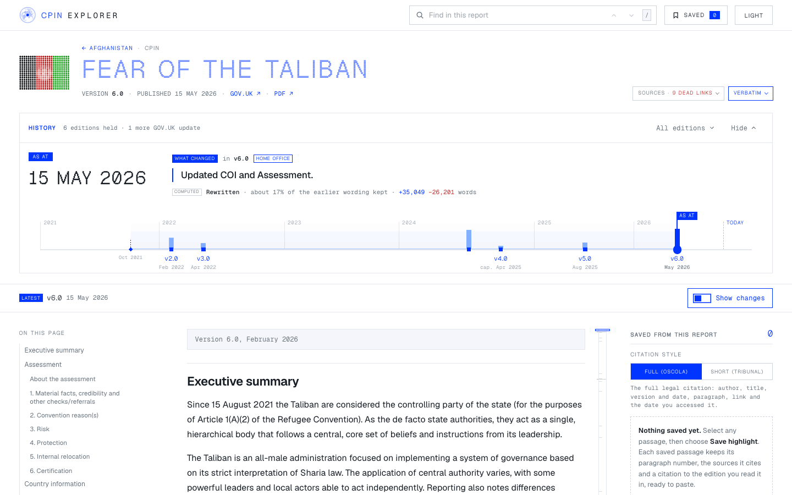

# CPIN Explorer: design handover

The visual design of CPIN Explorer, written down so that another app can be given the same look by
someone (or an AI agent) who has never seen CPIN Explorer. The first app in line is Quarterly Prep
(section 15).

**Snapshot.** Taken on 3 October 2026, between about 11:45 and 12:40 BST, from the working tree of
`~/Developer/cpin-explorer` (last commit `f389a3e`, plus uncommitted work). The site was being changed
while this was written. Where this document and the stylesheets disagree, the stylesheets win; what is
known to have moved during the day is listed in section 17.

## Contents

1. [What this is and how to use it](#1-what-this-is-and-how-to-use-it)
2. [The look at a glance](#2-the-look-at-a-glance)
3. [Design principles](#3-design-principles)
4. [Tokens](#4-tokens)
5. [Typography recipes](#5-typography-recipes)
6. [Components](#6-components)
7. [Layout](#7-layout)
8. [Motion](#8-motion)
9. [Dark mode](#9-dark-mode)
10. [Accessibility](#10-accessibility)
11. [Voice and wording](#11-voice-and-wording)
12. [Branding](#12-branding)
13. [Fonts and licences](#13-fonts-and-licences)
14. [Reskinning another app: checklist](#14-reskinning-another-app-checklist)
15. [Quarterly Prep: mapping](#15-quarterly-prep-mapping)
16. [What belongs to CPIN Explorer only](#16-what-belongs-to-cpin-explorer-only)
17. [Unsure, inferred, or in flux](#17-unsure-inferred-or-in-flux)
18. [Files in this folder](#18-files-in-this-folder)

---

## 1. What this is and how to use it

CPIN Explorer is a Roberts Macros work tool: a mirror of the Home Office's country policy and
information notes, with a globe to choose a country, a reading page for each report, a search, and a
page of saved highlights. This handover covers how it looks and moves, not what it does.

| File | What it is |
| --- | --- |
| `README.md` | This document: the rules, every value, each component, and how to apply them elsewhere. |
| `tokens.css` | One stylesheet with no dependencies: the tokens (light and dark), the four fonts, base elements and the reusable components. Link it from a blank page and it works. |
| `specimen.html` | One page that shows every token and component, built only from `tokens.css`, with a light/dark button. |
| `screenshots/` | The real site and the specimen, light and dark, desktop and phone. |
| `assets/` | Copies of the Roberts Macros mark and CPIN Explorer's product mark, so the specimen stands alone (`SOURCE.txt` records where they came from). |

To give another app this look:

1. Read section 3 (the principles). They matter more than any single value.
2. Copy `tokens.css` and the four font files into the app, and fix the font path (it is marked at the top of the file).
3. Open `specimen.html` beside the app while you work. To see it in this repository, run
   `python3 scripts/serve.py 8781` from the repository root and open
   `http://localhost:8781/docs/design-handover/specimen.html`. (The copy of this folder in
   `outputs/cpin-explorer-design-handover/` carries its own fonts and opens straight from disk.)
4. Work through the checklist in section 14. For Quarterly Prep, section 15 maps its tokens and components onto these.

The source of truth is the site's own CSS, in `prototypes/`:

| Source file | Holds |
| --- | --- |
| `shared/theme.css` | Tokens, `@font-face`, base elements, `.tag` `.eyebrow` `.btn` `.numeral` `.pop-in`, reduced motion |
| `shared/brand.css` | Header mark and wordmark, footer, moving between pages |
| `dashboard/dashboard.css` | Start page: app shell, search, stats, rows, cards, results, callouts, filter bar, checkbox |
| `reader/reader.css` | Report page: sticky bar, chips, segmented control, switch, popovers, toasts, long-form text, tables, skeleton, error |
| `shared/timeline.css` | The history timeline and the rolling digits |
| `saved/saved.css`, `guide/guide.css` | Saved page (menu, tools row), guide (in-page nav, folding rows) |
| `shared/minimap.css`, `shared/link-status.css` | Minimap strip; status tags after links |

In `tokens.css` every rule's declarations are copied unchanged. Class names are kept where the source
name is general (`.btn`, `.tag`, `.chip`, `.seg`, `.switch`, `.toast`, `.pop`, `.top`, `.brand`,
`.foot`). Where the source name was about countries or notes, the rule has a general name and a
`source:` comment (for example `.card` is `.note`, `.row` is `.country-row`, `.frame` is `.hist-frame`).
The few rules that are not straight copies are marked `generalised` in the file and in section 17.

---

## 2. The look at a glance

After the COBE globe site (cobe.vercel.app): a white page, one electric blue, square corners, thin
grey rules, small capital labels in a pixel font, and motion that eases.

| | Light | Dark |
| --- | --- | --- |
| Start page (app shell: header, globe, panel, footer) | [start-light.png](screenshots/start-light.png) | [start-dark.png](screenshots/start-dark.png) |
| A country chosen: cards, tags, buttons | [country-light.png](screenshots/country-light.png) | [country-dark.png](screenshots/country-dark.png) |
| Search results: groups with headings and counts | [search-light.png](screenshots/search-light.png) | [search-dark.png](screenshots/search-dark.png) |
| Report page: title, history, sticky bar, text | [report-light.png](screenshots/report-light.png) | [report-dark.png](screenshots/report-dark.png) |
| Report page with changes shown | [report-changes-light.png](screenshots/report-changes-light.png) | |
| Saved page (with items, and empty) | [saved-light.png](screenshots/saved-light.png), [saved-empty-light.png](screenshots/saved-empty-light.png) | [saved-dark.png](screenshots/saved-dark.png) |
| Guide page | [guide-light.png](screenshots/guide-light.png) | |
| Header and footer, close up | [header-light.png](screenshots/header-light.png), [footer-light.png](screenshots/footer-light.png) | [header-dark.png](screenshots/header-dark.png), [footer-dark.png](screenshots/footer-dark.png) |
| Phone (390 px wide) | [start](screenshots/start-phone-light.png), [search](screenshots/search-phone-light.png), [report](screenshots/report-phone-light.png), [saved, empty](screenshots/saved-phone-light.png) | [start](screenshots/start-phone-dark.png), [report](screenshots/report-phone-dark.png) |
| The specimen (`specimen.html`), whole page | [specimen-light.png](screenshots/specimen-light.png), [phone, first screens](screenshots/specimen-phone.png) | [specimen-dark.png](screenshots/specimen-dark.png) |





---

## 3. Design principles

Each has a do and a don't. If a new screen follows these, it will look right even where no component fits exactly.

**1. White, one blue, crisp.** The page is white (near-black in dark mode). There is one accent, an electric blue, and cool greys. One red exists and only ever means removed, dead or negative.
- Do: use blue for the thing that is chosen, current, clickable or added, and for the page title.
- Don't: add a second accent, a tinted or beige background, gradients, textures or serif type. An earlier beige and serif version was rejected as looking like an AI artefact.

**2. Four fonts, four jobs.** Geist for reading; Geist Mono for buttons, dates and meta; Geist Pixel (Square) for tags, eyebrows and numerals; Geist Pixel Line for the page title. All four stay.
- Do: put any label, count or control in one of the three non-reading fonts, in small capitals with letter-spacing.
- Don't: change, drop or add a font, or set sentences in the pixel fonts.

**3. Square corners, hairlines, no shadow on the page.** Boxes are 1px grey lines with `border-radius: 0`. Only things that float above the page (popovers, menus, toasts) have a shadow.
- Do: separate with a hairline or with space.
- Don't: round corners, lift cards with shadows, or fill panels with colour. The only round things are dots, the knob of a slider and the legend keys.

**4. No snaps.** Everything eases. Nothing jumps, flashes or shifts what is around it.
- Do: fade and slide things in and out; crossfade text that changes; ease heights open and closed.
- Don't: swap content in one frame, let a late-arriving element push the page down, or use a slow or showy transition. A spinning page transition was rejected as too slow.

**5. Calm hover.** Hover changes colour quickly and quietly. Anything bigger (lighting a country on the globe) waits until the pointer has rested.
- Do: change border or text colour in 160ms; for large effects wait about 60ms of rest and crossfade. A small mark (a dot a few pixels across) may fill, grow and sparkle under the pointer, so it is plainly the thing a click will go to.
- Don't: light things up as the pointer sweeps past, or scale and bounce buttons, cards and other boxes.

**6. Dots.** The globe is dots, so pictures are dots: the product mark is a dotted globe, flags are dot matrices, markers are dots.
- Do: draw an app's signature picture and its mark as dots in one colour.
- Don't: use photographs, illustrations or glossy icons as decoration.

**7. Dots are the targets, with generous hit areas.** What you click is the dot, not a border, and the invisible target is larger than what is drawn.
- Do: give small marks a target of at least 18px radius for a mouse and 44px across for a finger; when a tap could mean several things, ask (a short list by the finger) instead of guessing.
- Don't: make people aim at a thin line or a small glyph.

**8. One search, plain labels.** One search box finds everything. Labels say what a thing is or does, in ordinary words and UK English.
- Do: "Read the latest guidance", "Show changes", "Sources:", "Report a bug".
- Don't: write slogans, taglines, cute names or marketing copy. The Roberts Macros mark is used without its slogan.

**9. Tags, not paragraphs.** Facts about a thing are short tags and one mono line, not sentences.
- Do: `CPIN` · `15 MAY 2026 · V6.0` · `6 EDITIONS ON RECORD`.
- Don't: explain in a paragraph what a tag and a date can say.

**10. Honest states.** Say exactly what is the case, with the time and the time zone.
- Do: "Not held", "PDF only", "No longer on GOV.UK", "ACCURATE AS OF 03 OCT 2026 · 11:52 BST", "Computed" on anything the tool worked out itself.
- Don't: hide a gap, show a spinner with no words, or pulse a "live" dot beside a statement of fact.

**11. Never colour alone.** Added text is blue and underlined; removed text is red and struck through; a figure that fell has a minus sign.
- Do: pair every colour meaning with a shape, a sign or a word.
- Don't: rely on blue against red, or on colour for status.

**12. What changes keeps its place.** Regions whose content changes have a fixed height (single lines cut with an ellipsis, a caption box of fixed height), so nothing below moves.
- Do: reserve the width of the longest wording; cut long lines with an ellipsis and put the rest behind "More".
- Don't: let a longer label or a second line push the layout.

**13. A shell on a desktop, a page on a phone.** From 901px wide: header on top, content that scrolls inside, footer always in view. Narrower: an ordinary scrolling page. Everything works at 375px.
- Do: design for a 1080p laptop first, check 375px and a 4K monitor.
- Don't: let anything scroll sideways, or hide the footer credit on a desktop.

**14. Self-hosted.** Fonts, scripts and artwork are files in the project.
- Do: copy files in and record their version or revision.
- Don't: load anything from a CDN at run time, or hot-link artwork.

**15. Two marks.** The tool's own mark and wordmark sit at the top left. The Roberts Macros mark sits alone at the bottom left of the footer, in line with the "Sources:" credit; "Report a bug" is at the right of the footer.

---

## 4. Tokens

All tokens are CSS custom properties on `:root` with the names used in `prototypes/shared/theme.css`
(and, for the layout ones, `prototypes/reader/reader.css`). `tokens.css` section 2 has them ready to use.

### 4.1 Colour

The hex in brackets is what the browser draws in sRGB, measured from the running site.

| Token | Light | Dark | For |
| --- | --- | --- | --- |
| `--bg` | `#ffffff` | `#0a0c10` | The page |
| `--surface` | `#ffffff` | `#10131a` | Boxes on the page: cards, inputs, buttons, popovers |
| `--sunken` | `#f6f7f9` | `#151922` | Set-back areas: table heads, empty-state boxes, muted tags, `kbd`, a card that is no longer current |
| `--ink` | `#171d24` | `#e7eaf0` | Text |
| `--ink-2` | `#66717c` | `#9aa4b2` | Secondary text, labels, meta, eyebrows |
| `--ink-3` | `#9aa3ad` | `#6b7480` | Placeholders, separators, timestamps, paragraph numbers |
| `--line` | `#e4e7eb` | `#232834` | Hairlines, card borders, rules between rows |
| `--line-strong` | `#cfd4da` | `#323949` | Borders of controls: buttons, inputs, popovers |
| `--blue` | `lab(36 55.64 -107.68)` (`#0034ff`); fallback `#2a3cf5` | `lab(58 38 -82)` (`#7f77ff`); fallback `#6b7cff` | The one accent: links, tags, titles, the chosen thing, the focus ring |
| `--blue-ink` | `#ffffff` | `#ffffff` | Text on blue |
| `--blue-wash` | `color-mix(in oklab, var(--blue) 7%, var(--bg))` (`#ecf4ff`) | same formula (`#10131f`) | Hover and selected backgrounds, the 3px focus halo of inputs, callouts |
| `--blue-line` | `color-mix(in oklab, var(--blue) 35%, var(--bg))` (`#a1c5ff`) | same formula (`#2e2f62`) | Quiet underlines of links in text, "in range" edges |
| `--ins` | `var(--blue)` | `var(--blue)` | Added text; a figure that rose |
| `--ins-wash` | `color-mix(in oklab, var(--blue) 10%, var(--bg))` (`#e4efff`) | blue 22% (`#1f2242`) | Behind added text |
| `--del` | `#c2262e` | `#ff7b81` | Removed text; dead links; a figure that fell |
| `--del-wash` | `color-mix(in oklab, #e0434b 12%, var(--bg))` (`#ffeae9`) | 22% (`#331a1d`) | Behind removed text |
| `--focus` | `var(--blue)` | `var(--blue)` | The focus outline |
| `--mark` | `var(--ins-wash)` | `var(--ins-wash)` | A saved highlight in text |
| `--mark-strong` | `color-mix(in oklab, var(--blue) 22%, var(--bg))` (`#c4dbff`) | same formula (`#1f2242`) | A highlight under the pointer |
| `--shadow` | `0 1px 2px rgb(16 24 40 / .04), 0 14px 36px -14px rgb(16 24 40 / .22)` | `0 1px 2px rgb(0 0 0 / .3), 0 14px 36px -14px rgb(0 0 0 / .7)` | Floating things only |

`--blue` is declared twice on purpose: the hex first, for browsers without `lab()`, then the `lab()`
value, which wins where it is understood. On a wide-gamut screen the `lab()` blue is a little more
saturated than any sRGB hex.

Colours used directly in rules (not tokens):

| Value | Where |
| --- | --- |
| `color-mix(in oklab, var(--blue) 22%, transparent)` | `::selection` |
| `color-mix(in oklab, var(--blue) 16%, transparent)` | `mark`: a search match in a list (15% plus `inset 0 -1px 0 var(--blue-line)` inside an excerpt) |
| `color-mix(in oklab, var(--bg) 86%, transparent)` + `blur(14px) saturate(1.4)` | The sticky header's glass, on pages that scroll (90% for the sticky bar, 88% and `blur(12px)` for tool rows) |
| `color-mix(in oklab, var(--blue-ink) 22%–28%, transparent)` | Dividers between buttons on a blue bar |
| `color-mix(in oklab, #000 14%–16%, var(--blue))` | Hover on a button that sits on blue |
| `color-mix(in oklab, var(--blue) 20% / 45% / 55%, var(--surface))` | Bars on the timeline: at rest, in range, the base edition |
| `rgb(10 12 16 / .28)` | Backdrop behind a bottom sheet |
| `#6c7a99` | Legend key and globe markers for "other countries" |
| `#2a3cf5` / `#8b96ff` | The favicon's blue, light and dark |
| `rgb(226 230 236)` / `rgb(52 58 72)` | A near-white dot of a dotted flag on a white page / a near-black dot in dark mode |
| `#fff` | The plate behind charts and maps inside reports, kept white in dark mode |

Rules: blue is the only accent. Red is never decoration. There is no green and no amber. Greys are cool (blue-grey), never warm.

### 4.2 Type

| Token | Stack | Job |
| --- | --- | --- |
| `--font-text` | `"Geist", system-ui, -apple-system, "Segoe UI", sans-serif` | Reading text, titles of things, sentences |
| `--font-mono` | `"Geist Mono", ui-monospace, "SF Mono", Menlo, monospace` | Buttons, dates, meta lines, the footer credit, figures in tables |
| `--font-pixel` | `"Geist Pixel", "Geist Mono", ui-monospace, monospace` | Tags, eyebrows, numerals, small capital labels, the first word of the wordmark (this is Geist Pixel Square) |
| `--font-display` | `"Geist Pixel Line", "Geist Pixel", ui-monospace, monospace` | The page title only |

**Root size (fluid).** `:root { font-size: clamp(15px, 0.42vw + 8.6px, 22px); }` and every size is in
`rem`, so the whole interface scales with the window. Measured: 15px up to about 1520px wide (so a
phone, and a 1440px laptop); 16.7px at 1920; 19.4px at 2560; 22px from about 3190px (4K).

**Sizes in use** (px at a 15px root):

| Size | px | Font | Used for |
| --- | --- | --- | --- |
| `.52`–`.58rem` | 8–9 | Pixel | A tag sitting inside a mono line or a bar |
| `.62rem` | 9.3 | Pixel | Chips, segmented control, figure captions, years on the timeline |
| `.64rem` | 9.6 | Pixel | Legend, the action inside a toast, small label buttons |
| `.66rem` | 9.9 | Mono | Blue tooltip tag |
| `.68rem` | 10.2 | Pixel, Mono | Eyebrow; footer links; badges; timestamps |
| `.7rem` | 10.5 | Pixel, Mono | Label buttons, filter labels, "more" links; footer credit; source note |
| `.72rem` | 10.8 | Pixel, Mono | Tag; card meta; status line |
| `.74rem` | 11.1 | Mono | Meta line; small buttons; table heads |
| `.76`–`.78rem` | 11.4–11.7 | Mono, Geist | Sticky bar text; toast; tooltip text |
| `.8rem` | 12 | Mono, Geist | Button; switch; navigation list |
| `.84`–`.88rem` | 12.6–13.2 | Geist | Popover text, option rows, excerpts, tables |
| `.9`–`.92rem` | 13.5–13.8 | Geist | List rows, search input, callouts, empty lines |
| `.95rem` | 14.25 | Geist 560, Mono | Title of a block row; the wordmark |
| `1rem` | 15 | Geist | Body, lede |
| `1.06rem` | 15.9 | Geist | Card title (560); long-form text |
| `1.1`–`1.32rem` | 16.5–19.8 | Geist 600–620 | Headings inside boxes; section headings |
| `1.5rem` | 22.5 | Geist 620, Pixel | Long-form `h2`; section numerals |
| `clamp(2rem, 2.7vw, 3rem)` | 30–45 | Pixel | Stat numerals |
| `clamp(1.7rem, 1.05rem + 1.2vw, 2.6rem)` | 25.5–39 | Pixel | The date that rolls |
| `clamp(2rem, 3vw, 3.4rem)` to `clamp(2.4rem, 4.2vw, 4.4rem)` | 30–66 | Pixel Line | Page titles |

**Weights** (Geist is a variable font, so in-between weights are real): 400 body; 500 emphasis in mono and a statement in a caption; 560 the title of a thing in a list; 600 strong text and small headings; 620 headings. The pixel fonts have one weight (400).

**Letter-spacing.** Body `.005em`. Geist headings go negative as they grow: `-.01em` at 1.06–1.3rem, `-.022em` at 1.5rem, `-.03em` at 1.9–2.7rem. Mono `0` or `.02em`. Pixel `.04em`–`.12em`, wider as it gets smaller. Pixel Line `.06em`–`.08em`. Wordmark `.22em` (mono) and `.16em` (pixel).

**Line-height.** Body 1.55; long-form 1.7; headings 1.02–1.35; tags 1; excerpts 1.5.

**Capitals** are applied with `text-transform: uppercase` (eyebrows, tags, chips, label buttons, meta lines, page titles). Write the text in sentence case.

**Numerals** are `font-variant-numeric: tabular-nums` wherever they line up or change (numerals, tables, counts).

### 4.3 Spacing and sizes

There is no numeric spacing scale; these are the measures that recur.

| What | Value |
| --- | --- |
| Page gutter (`--pad-x`) | `clamp(1rem, 2.4vw, 2.75rem)` |
| Panel padding | `clamp(1.25rem, 2.4vw, 2.75rem)` |
| Header height (`--top-h`) | `3.75rem` |
| Sticky bar | `min-height: 3.3rem`, padding `.45rem var(--pad-x)` |
| Footer padding | `1.1rem var(--pad-x)` on a page; `.55rem` top and bottom in the app shell |
| Button | `min-height: 2.4rem`, padding `0 .85rem`; small `2.1rem`; header controls `2.35rem` |
| Search box | `2.35rem` high in the header, `2.5rem` in the content; padding `0 .7rem` |
| Chip, segmented control, switch | `1.75rem`; `1.9rem` (mono version `2.15rem`); `2.4rem` (`2.6rem` on phones) |
| A row to tap on a phone | at least `44px` high |
| Card | padding `1rem 1.1rem 1.05rem`, `gap: .55rem` inside, `.7rem` between cards |
| Section | `margin-bottom: 2.2rem`; its heading has `padding-bottom: .55rem` and `margin-bottom: .8rem` |
| List row | padding `.5rem .1rem`; block row `.75rem .1rem .8rem` |
| Frame head | `min-height: 3.5rem`, padding `.6rem 1.1rem` |
| Popover | head `.7rem .85rem .6rem`, body `.8rem .85rem .9rem` |
| Callout | padding `.75rem .9rem` |
| Gaps inside a line of small things | `.4rem`–`.6rem`; between buttons `.45rem` |
| Reading measure (`--measure`) | `70ch`, plus a `4.4rem` gutter for hanging paragraph numbers |
| Widths | lede `38rem`–`40rem`; empty box `46rem`; a document page `64rem`; popover `min(28rem, 100vw - 1.5rem)`; search `min(30rem, 38vw)` |

### 4.4 Borders, radii, shadows

- Borders are `1px solid`: `--line` for boxes on the page, `--line-strong` for controls, `--blue` when hovered, open or chosen. Dashed `--line-strong` means "nothing here yet". A `2px` blue rule on the left marks a callout or a quotation. Underlines of tabs and thumbs are `2px`–`3px` blue.
- `border-radius` is `0` everywhere (controls set it explicitly to beat browser defaults). Round exceptions: dots and legend keys (`50%`), the knob of the timeline handle, the invisible hit area around a globe dot.
- Shadows: `--shadow` on popovers, the selection toolbar, toasts, the dock and sheets. A menu uses `0 14px 34px -16px color-mix(in oklab, var(--ink) 35%, transparent)`. The sticky bar gains `0 10px 22px -20px rgb(16 24 40 / .55)` once content has scrolled under it. Nothing that rests on the page has a shadow.
- Focus: `outline: 2px solid var(--focus); outline-offset: 2px` on `:focus-visible`. Inputs instead take a blue border and `box-shadow: 0 0 0 3px var(--blue-wash)`. Rows that fill their box use `outline-offset: -2px`.

### 4.5 Layers

| `z-index` | What |
| --- | --- |
| 70 | Toasts |
| 60 | Skip link |
| 55 | Bottom sheet |
| 50 | Sheet backdrop |
| 45 | Popover |
| 40 | Selection toolbar |
| 35 | Dock (phones) |
| 30 | Header on pages that scroll; the pop-up under a header button; menus; tooltips |
| 27 | A chip's panel and a drop-down just under the header |
| 25 | Sticky bar |
| 20 | Header on the start page; sticky tool rows |
| 15 | A sticky filter row inside the content |
| 2–8 | Inside one component: labels over dots (2–3), filter menus (4–6), zoom buttons (5), the "Which country?" list (8) |

### 4.6 Time

| Token | Value | For |
| --- | --- | --- |
| `--t-fast` | `160ms` | Colour, border and opacity on hover and focus; tooltips |
| `--t` | `280ms` | Things that move or appear: thumbs, the switch, popovers, pop-in, the slide of a row, crossfades |
| `--t-slow` | `520ms` | Large moves: folding a section, a sheet, the entrance of a page head, the mark's turn on hover |
| `--ease` | `cubic-bezier(.2, .8, .2, 1)` | Everything: a quick start and a long, soft landing |
| `--ease-in-out` | `cubic-bezier(.65, 0, .35, 1)` | Loops that go back and forth (the skeleton's shimmer) |

Other timings are in section 8.

---

## 5. Typography recipes

| Recipe | CSS |
| --- | --- |
| **Eyebrow** (small label above a title, or a section's name) | `font-family: var(--font-pixel); font-size: .68rem; letter-spacing: .12em; text-transform: uppercase; color: var(--ink-2); margin: 0;` |
| **Tag** | `font-family: var(--font-pixel); font-size: .72rem; line-height: 1; letter-spacing: .06em; text-transform: uppercase; padding: .38em .55em .34em; background: var(--blue); color: var(--blue-ink);` |
| **Meta line** | `font-family: var(--font-mono); font-size: .74rem; letter-spacing: .02em; text-transform: uppercase; color: var(--ink-2);` values in `<b>` at weight 500 and `--ink`; parts joined by a middle dot in `--ink-3` |
| **Body** | `font-family: var(--font-text); line-height: 1.55; letter-spacing: .005em; color: var(--ink);` with font smoothing on |
| **Lede** | body text in `--ink-2`, `max-width: 38rem` |
| **Page title** | `font-family: var(--font-display); font-weight: 400; font-size: clamp(2rem, 3vw, 3.4rem); letter-spacing: .07em; line-height: 1.02; color: var(--blue); text-transform: uppercase;` One per page. Country names use `clamp(2.3rem, 3.8vw, 4.2rem)` and `.06em`; report titles `clamp(2.1rem, 3.1vw, 3.8rem)`, `.06em`, `text-wrap: balance` |
| **Title of a thing** (card, result) | `font-size: 1.06rem; font-weight: 560; line-height: 1.35;` in Geist |
| **Section heading on a document page** | `font-size: 1.32rem; line-height: 1.25; font-weight: 620; letter-spacing: -.018em; text-wrap: balance;` |
| **Long-form headings** | `h2`: `1.5rem / 1.25`, 620, `-.022em`, with a hairline and `1.2rem` of padding above. `h3`: `1.16rem / 1.35`, 620, `-.012em`. `h4`: `1.03rem / 1.4`, 600 |
| **Long-form text** | `font-size: 1.06rem; line-height: 1.7; letter-spacing: 0; max-width: 70ch;` list markers are blue squares |
| **Numeral** | `font-family: var(--font-pixel); font-variant-numeric: tabular-nums; letter-spacing: .02em;` large ones `clamp(2rem, 2.7vw, 3rem)`, `line-height: 1`, `--blue` |
| **Wordmark** | first word: Pixel, `--blue`, `letter-spacing: .16em`; second word: Mono, `--ink`, `letter-spacing: .22em`; both `.95rem` |
| **Footer credit** | `font-family: var(--font-mono); font-size: .7rem; line-height: 1.6; color: var(--ink-2);` begins "Sources:" |
| **Key** (`kbd`) | `font-family: var(--font-mono); font-size: .7em; padding: .1em .4em; border: 1px solid var(--line-strong); color: var(--ink-2); background: var(--sunken);` |

---

## 6. Components

Each entry gives the purpose, the parts, the states, the CSS (as in `tokens.css`, trimmed) and notes.
The specimen shows every one. "Source" names the original selector and file.

### 6.1 Header with mark and wordmark

**Purpose.** Says which tool this is and holds the few global controls. **Parts,** left to right: the product mark and wordmark (a link to the start page); on other pages a crumb naming the page; the search box (pushed right); label buttons; the status line; the theme button (AUTO, LIGHT, DARK in turn) last.
**States.** On a page that scrolls it sticks and is frosted glass. In the app shell nothing scrolls under it, so it is solid. Up to 900px it wraps: the search takes a row of its own. Hovering the brand turns the mark 12° over 520ms.

```css
.top {
  position: sticky; top: 0; z-index: 30; display: flex; align-items: center; gap: .9rem;
  height: var(--top-h); padding: 0 var(--pad-x);
  background: color-mix(in oklab, var(--bg) 86%, transparent); backdrop-filter: blur(14px) saturate(1.4);
  border-bottom: 1px solid var(--line);
}
.brand { display: inline-flex; align-items: center; gap: .6rem; color: var(--ink); text-decoration: none; flex: none; }
.brand-mark { width: 2.1rem; height: 2.1rem; color: var(--blue); flex: none; transition: transform var(--t-slow, 520ms) var(--ease, ease); }
.brand:hover .brand-mark { transform: rotate(-12deg); }
.brand-name { font-family: var(--font-mono); font-size: .95rem; letter-spacing: .22em; white-space: nowrap; }
.brand-name b { font-family: var(--font-pixel); font-weight: 400; font-size: 1em; letter-spacing: .16em; color: var(--blue); margin-right: .55em; }
.top-crumb { font-family: var(--font-pixel); font-size: .7rem; letter-spacing: .12em; text-transform: uppercase; color: var(--ink-2); padding-left: .9rem; border-left: 1px solid var(--line); }
@media (max-width: 600px) { .brand-mark { width: 1.8rem; height: 1.8rem; } .brand-name { font-size: .8rem; letter-spacing: .16em; } .brand-name b { letter-spacing: .12em; } }
```

```html
<header class="top">
  <a class="brand" href="./" aria-label="CPIN Explorer home">
    <svg class="brand-mark" viewBox="0 0 64 64" aria-hidden="true"><use href="…/mark.svg#mark"/></svg>
    <span class="brand-name"><b>CPIN</b>EXPLORER</span>
  </a>
  …
</header>
```

**Notes.** The mark is one colour (`currentColor`), so it takes the theme's blue. Reserve the width of anything in the header whose words change (the status line has `min-width: 38ch`; the theme button `min-width: 4.6rem`), so nothing shifts. Source: `.top` (dashboard.css, reader.css), `.brand*` (brand.css), `.top-crumb` (saved.css).

### 6.2 Footer

**Purpose.** Credit and the way to report a problem; always in view on a desktop. **Parts:** the Roberts Macros mark alone at the left; the credit, beginning "Sources:", in mono; at the right, quiet links and the "Report a bug" button.
**States.** Two images for the mark: ink for light, light for dark. At 600px and under the footer wraps and the right-hand group takes its own row. If nothing in the right-hand group is visible, the group disappears.

```css
.foot { display: flex; flex-wrap: nowrap; align-items: center; justify-content: flex-start; gap: .6rem 1.1rem;
  padding: 1.1rem var(--pad-x); border-top: 1px solid var(--line); font-family: var(--font-mono); font-size: .7rem; line-height: 1.6; color: var(--ink-2); background: var(--bg); }
.foot > span:not(.foot-rm):not(.foot-end) { flex: 1 1 auto; min-width: 0; }
.foot-rm img { width: auto; height: 1.7rem; display: block; }
.foot-rm .rm-light { display: none; }
:root[data-theme="dark"] .foot-rm .rm-ink { display: none; }
:root[data-theme="dark"] .foot-rm .rm-light { display: block; }
.foot-end { display: inline-flex; align-items: center; gap: 1.1rem; margin-left: auto; flex: none; }
.foot-link { font-family: var(--font-mono); font-size: .68rem; letter-spacing: .06em; text-transform: uppercase; color: var(--ink-2); }
.foot-bug { font-family: var(--font-mono); font-size: .68rem; letter-spacing: .06em; text-transform: uppercase; padding: .45rem .7rem; }
```

```html
<footer class="foot">
  <span class="foot-rm"></span>
  <span>Sources: <a href="…">Home Office, GOV.UK</a>. …</span>
  <span class="foot-end"><a class="foot-link" href="…">Guide</a><a class="btn foot-bug" href="…">Report a bug</a></span>
</footer>
```

**Notes.** "Report a bug" opens an email with the page and browser filled in; the address is configuration, not design, and the button stays hidden until one is set. Source: brand.css; box and type from dashboard.css and reader.css.

### 6.3 Buttons

**Purpose.** Do something. **Kinds:** primary (filled blue; one per group, the main thing to do); secondary (outlined, the default); quiet (no box until hovered, for the lesser buttons beside a boxed one); small (inside cards and popovers); label (pixel capitals, for header controls); delete (the quietest of all).
**States.** Hover: border and text turn blue (primary: `brightness(1.08)`). Focus: the 2px ring. Disabled: `opacity: .4`. A quiet button that opens a menu stays washed while the menu is open.

```css
.btn {
  display: inline-flex; align-items: center; justify-content: center; gap: .45em;
  min-height: 2.4rem; padding: 0 .85rem; border: 1px solid var(--line-strong); border-radius: 0;
  background: var(--surface); color: var(--ink); cursor: pointer;
  font-family: var(--font-mono); font-size: .8rem; letter-spacing: .02em;
  transition: border-color var(--t-fast) var(--ease), color var(--t-fast) var(--ease), background var(--t-fast) var(--ease);
}
.btn:hover { border-color: var(--blue); color: var(--blue); }
.btn--primary { background: var(--blue); border-color: var(--blue); color: var(--blue-ink); }
.btn--primary:hover { color: var(--blue-ink); filter: brightness(1.08); }
.btn--quiet { gap: .35rem; padding: 0 .65rem; border-color: transparent; background: none; color: var(--ink-2); }
.btn--quiet:hover { border-color: transparent; background: var(--blue-wash); color: var(--blue); }
.btn--sm { min-height: 2.1rem; font-size: .74rem; }
.btn--label { min-height: 2.35rem; font-family: var(--font-pixel); font-size: .7rem; letter-spacing: .1em; text-transform: uppercase; }
.btn--del { color: var(--ink-2); border-color: transparent; }
.btn--del:hover { color: var(--ink); border-color: var(--line-strong); }
.btn svg { width: .9rem; height: .9rem; flex: none; }
```

**Link-ish.** A link is blue with no underline until hovered (`text-underline-offset: .2em`). In long text it is underlined in `--blue-line` and the underline darkens on hover. A button inside a sentence is `.linklike`. A "see everything" link at the foot of a list is `.more`: pixel capitals in blue with an arrow.

```css
.linklike { border: 0; padding: 0; background: none; color: var(--blue); font: inherit; cursor: pointer; text-decoration: underline; text-decoration-color: var(--blue-line); text-underline-offset: .2em; }
.more { display: inline-flex; align-items: center; margin-top: .7rem; padding: 0; border: 0; background: none; cursor: pointer;
  font-family: var(--font-pixel); font-size: .7rem; letter-spacing: .1em; text-transform: uppercase; color: var(--blue); }
```

**Notes.** Labels are verbs in sentence case ("Copy all citations"). Arrows carry direction: `←` back, `→` onward, `↗` leaves the site. Icons are line drawings in `currentColor`, stroke 1.4–1.8, no fill, on a 16 or 20 unit grid. Source: `.btn` (theme.css); `.clog-btn`, `.hist-toggle`, `.note-actions .btn`, `.theme-btn`, `.btn-del`, `.linklike` (reader.css, dashboard.css).

### 6.4 Tags, chips and badges

**Tag.** Names the kind of thing, or a state. Not clickable unless it is a `<button>`.
Kinds: filled blue (the main label: "Latest", "What changed"); outline (a category: "CPIN", "Home Office"); muted (a quiet fact: "PDF only", "Not held"); calc ("Computed": the tool's own working); dead (a problem). A tag inside a mono line shrinks to `.52`–`.58rem`.

```css
.tag { display: inline-flex; align-items: center; gap: .4em;
  font-family: var(--font-pixel); font-size: .72rem; line-height: 1; letter-spacing: .06em;
  text-transform: uppercase; white-space: nowrap;
  padding: .38em .55em .34em; background: var(--blue); color: var(--blue-ink); }
.tag--outline { background: var(--bg); color: var(--blue); box-shadow: inset 0 0 0 1px var(--blue); }
.tag--muted { background: var(--sunken); color: var(--ink-2); box-shadow: inset 0 0 0 1px var(--line); }
.tag--calc { background: var(--surface); color: var(--ink-2); box-shadow: inset 0 0 0 1px var(--line-strong); }
.tag--dead { background: var(--del-wash); color: var(--del); box-shadow: inset 0 0 0 1px var(--del); }
```

A tag that is a button is a filter that is on (filled, with "×"; hover `brightness(1.12)`) or a suggestion (outline; fills blue on hover).

**Chip.** A small boxed label that opens a panel of detail under it. It has a caret that turns when open, and may carry a value after a middle dot.
States: rest (grey border, `--ink-2`); hover and open (blue border and text); open also has the blue wash; `aria-expanded` drives it.

```css
.chip { display: inline-flex; align-items: center; gap: .55em; height: 1.75rem; padding: 0 .6rem; border: 1px solid var(--line-strong); border-radius: 0;
  background: var(--surface); color: var(--ink-2); cursor: pointer; white-space: nowrap;
  font-family: var(--font-pixel); font-size: .62rem; line-height: 1; letter-spacing: .1em; text-transform: uppercase;
  transition: border-color var(--t-fast) var(--ease), color var(--t-fast) var(--ease), background-color var(--t-fast) var(--ease); }
.chip::after { content: ""; width: .32rem; height: .32rem; margin: -.15rem 0 0 .1rem; border: solid currentColor; border-width: 0 1.5px 1.5px 0; transform: rotate(45deg); opacity: .7; transition: transform var(--t) var(--ease), margin var(--t) var(--ease); }
.chip[aria-expanded="true"]::after { transform: rotate(225deg); margin-top: .15rem; }
.chip:hover, .chip[aria-expanded="true"] { border-color: var(--blue); color: var(--blue); }
.chip[aria-expanded="true"] { background: var(--blue-wash); }
```

**Badge.** A quiet status in mono with a small square before it: solid blue for "as it was", hollow for "changed since".

```css
.badge { display: inline-flex; align-items: center; gap: .35em; font-family: var(--font-mono); font-size: .68rem; line-height: 1.3; color: var(--ink-2); }
.badge::before { content: ""; width: .45rem; height: .45rem; background: var(--blue); flex: none; }
.badge--changed::before { background: transparent; box-shadow: inset 0 0 0 1.5px var(--blue); }
```

Source: `.tag*` (theme.css, reader.css), `.linkstatus--dead` (link-status.css), `.chip` (reader.css), `.badge` (reader.css).

### 6.5 Segmented control, switch, filter bar, tabs, checkbox

**Segmented control.** Choose one of a few. A blue thumb slides behind the chosen option and the labels change colour as it passes. `role="radiogroup"`, each button `role="radio"` with `aria-checked`.

```css
.seg { position: relative; display: inline-grid; grid-auto-flow: column; grid-auto-columns: 1fr; border: 1px solid var(--line-strong); background: var(--surface); isolation: isolate; }
.seg button { position: relative; z-index: 1; min-height: 1.9rem; padding: 0 .7rem; border: 0; border-radius: 0; background: none; cursor: pointer;
  font-family: var(--font-pixel); font-size: .62rem; letter-spacing: .08em; text-transform: uppercase; color: var(--ink-2); white-space: nowrap;
  transition: color var(--t) var(--ease); }
.seg button[aria-checked="true"] { color: var(--blue-ink); }
.seg-thumb { position: absolute; z-index: 0; top: 0; bottom: 0; left: 0; width: calc(100% / var(--n, 2)); background: var(--blue);
  transform: translateX(calc(var(--i, 0) * 100%)); transition: transform var(--t) var(--ease); }
```

The source has two options: `width: 50%` and `.seg[data-value="tribunal"] .seg-thumb { transform: translateX(100%); }`. The version above is the same rule for any number of equal options (`--n` how many, `--i` which). A larger mono version with icons is `.seg--mono` (source `.vseg`: `min-height: 2.15rem`, Mono `.74rem`). One line under the control says what the chosen option gives.

**Switch.** One thing on or off. Square. Off, it is an outlined blue button; on, it fills blue and its label says what pressing it will now do ("Show changes" becomes "Hide changes"). `role="switch"` with `aria-checked`.

```css
.switch { display: inline-flex; align-items: center; gap: .6rem; min-height: 2.4rem; padding: 0 .9rem 0 .65rem;
  border: 1px solid var(--blue); border-radius: 0; background: var(--surface); color: var(--blue); cursor: pointer;
  font-family: var(--font-mono); font-size: .8rem; letter-spacing: .02em; white-space: nowrap;
  transition: background-color var(--t) var(--ease), color var(--t) var(--ease), border-color var(--t) var(--ease); }
.switch .sw { position: relative; width: 2.15rem; height: 1.15rem; box-shadow: inset 0 0 0 1.5px currentColor; flex: none; }
.switch .sw i { position: absolute; top: 3px; left: 3px; width: calc(1.15rem - 6px); height: calc(1.15rem - 6px); background: currentColor; transition: transform var(--t) var(--ease); }
.switch:hover { background: var(--blue-wash); }
.switch[aria-checked="true"] { background: var(--blue); color: var(--blue-ink); }
.switch[aria-checked="true"] .sw i { transform: translateX(1rem); }
```

**Filter bar.** A blue band of pixel labels; the chosen one is underlined and the rest are at 62% opacity. `aria-pressed`.

```css
.filters { display: flex; flex-wrap: wrap; gap: 0 1.3rem; margin: 1.4rem 0 0; padding: .55rem .9rem; background: var(--blue); }
.filter { border: 0; padding: .2rem 0; background: none; color: var(--blue-ink); cursor: pointer; opacity: .62;
  font-family: var(--font-pixel); font-size: .7rem; letter-spacing: .08em; text-transform: uppercase; transition: opacity var(--t-fast) var(--ease); }
.filter:hover, .filter[aria-pressed="true"] { opacity: 1; }
.filter[aria-pressed="true"] { text-decoration: underline; text-underline-offset: .35em; }
```

**Tabs.** Pixel labels on a hairline; the current one is blue with a 2px blue line under it (`.tabs`, `.tab[aria-selected="true"]`; source `.sheet-tabs`).

**Checkbox.** A `.85rem` square that fills blue and grows a tick cut with `clip-path`. The real `<input>` is inside the `<label>` and visually hidden, so the keyboard and screen readers get a real checkbox. Hover turns the label blue and slides it `.3rem`.

```css
.opt-box { flex: none; position: relative; width: .85rem; height: .85rem; border: 1.5px solid var(--line-strong); background: var(--bg); }
.opt-box::after { content: ""; position: absolute; inset: 2px; background: var(--blue-ink); transform: scale(0); transition: transform var(--t) var(--ease); }
.opt input:checked + .opt-box { background: var(--blue); border-color: var(--blue); }
.opt input:checked + .opt-box::after { transform: scale(1); clip-path: polygon(14% 52%, 0 68%, 38% 100%, 100% 22%, 86% 8%, 38% 70%); }
.opt input:focus-visible + .opt-box { outline: 2px solid var(--blue); outline-offset: 2px; }
```

**Navigation list.** The sections of a page, or the pages of an app, down a hairline. The current one is blue on the blue wash and a 2px blue marker glides along the hairline to it. A count sits at the right as a small blue tag. (`.nav`, `.nav-list`, `.nav-ind`; source `.toc` in reader.css and `.gd-nav` in guide.css.) On a phone the same list moves into a bottom sheet or becomes two or three tabs under the header.

Source: `.seg`, `.vseg`, `.switch` (reader.css); `.filters`, `.opt` (dashboard.css).

### 6.6 Search box and results

**Purpose.** One box that finds everything; results in groups. **Parts:** a `<label>` holding a magnifier icon, the input and a `<kbd>` hint. Focus puts a blue border and a 3px wash halo on the whole box and turns the icon blue. `⌘K` or `/` focuses it.

```css
.search { display: flex; align-items: center; gap: .55rem; width: min(30rem, 38vw); height: 2.35rem;
  padding: 0 .7rem; border: 1px solid var(--line-strong); background: var(--surface); color: var(--ink-2);
  transition: border-color var(--t-fast) var(--ease), box-shadow var(--t-fast) var(--ease); }
.search:focus-within { border-color: var(--blue); box-shadow: 0 0 0 3px var(--blue-wash); color: var(--blue); }
.search input { flex: 1; min-width: 0; border: 0; outline: 0; background: transparent; color: var(--ink); font: inherit; font-size: .9rem; }
.search input::placeholder { color: var(--ink-3); }
```

**Results.** Above them, an eyebrow ("Search") and the query as the page title in quotation marks. Then groups in a fixed order, each under a section heading: an eyebrow on the left, its count on the right, a hairline under both. Within a group, a sub-group has its name at weight 560 and its size in blue pixel capitals. Matches are marked with a pale blue wash. A group that is cut short ends with a `.more` link ("All 613 passages →").

```css
.section-head { display: flex; align-items: baseline; justify-content: space-between; gap: 1rem; margin: 0 0 .8rem; padding-bottom: .55rem; border-bottom: 1px solid var(--line); }
.group-head { display: flex; align-items: baseline; justify-content: space-between; gap: 1rem; margin: 0 0 .4rem; font-size: 1rem; font-weight: 560; line-height: 1.3; }
.group-n { flex: none; font-family: var(--font-pixel); font-weight: 400; font-size: .68rem; letter-spacing: .1em; text-transform: uppercase; color: var(--blue); }
mark { background: color-mix(in oklab, var(--blue) 16%, transparent); color: inherit; padding: 0 .05em; }
```

**Notes.** A search never dead-ends: with nothing found it shows the empty box of 6.11 with suggestions. While new results load, the old ones stay and dim (6.11). The placeholder says what can be searched ("Search countries, reports and their text"). Source: `.search`, `.section-head`, `.rgroup-head`, `mark` (dashboard.css).

### 6.7 List rows

**Row.** A line of text on a hairline, not a box. Parts: an optional dotted picture, the name (cut with an ellipsis), and at the right a count in pixel or a date in mono. Hover and focus: the text turns blue and the row slides `.3rem` right.

```css
.row { display: flex; align-items: center; gap: .55rem; width: 100%; padding: .5rem .1rem; border: 0; border-bottom: 1px solid var(--line);
  background: none; color: var(--ink); font: inherit; font-size: .92rem; text-align: left; cursor: pointer;
  transition: color var(--t-fast) var(--ease), padding var(--t) var(--ease); }
.row:hover, .row:focus-visible { color: var(--blue); padding-left: .4rem; }
.row .name { flex: 1; min-width: 0; overflow: hidden; text-overflow: ellipsis; white-space: nowrap; }
.row .count { font-family: var(--font-pixel); font-size: .78rem; color: var(--ink-2); }
```

**Block row** (`.hit`). For a result with an excerpt: a top line (tag and title at 560), a mono line saying where, and up to three lines of excerpt in `--ink-2`. Hover: a blue wash, the same slide, and the title turns blue.

```css
.hit { display: grid; gap: .3rem; padding: .75rem .1rem .8rem; border-bottom: 1px solid var(--line); color: var(--ink);
  transition: background var(--t-fast) var(--ease), padding var(--t) var(--ease); }
.hit:hover, .hit:focus-visible { text-decoration: none; background: var(--blue-wash); padding-left: .5rem; padding-right: .3rem; }
.hit-excerpt { font-size: .88rem; line-height: 1.5; color: var(--ink-2); display: -webkit-box; -webkit-line-clamp: 3; -webkit-box-orient: vertical; overflow: hidden; }
```

Rows fill a grid with `repeat(auto-fill, minmax(12.5rem, 1fr))` and a `1.4rem` column gap. Source: `.country-row`, `.rhit`, `.thit` (dashboard.css).

### 6.8 Panels, cards, frames, stats, callouts

**Panel.** The column of words beside the main picture in the app shell. It has padding `clamp(1.25rem, 2.4vw, 2.75rem)`, no border of its own, and scrolls inside the shell. Its children pop in one after another, 45ms apart (first eight only).

**Card.** One thing in a list of things. A hairline box, no shadow, no rounding. Parts, top to bottom: a top line (a tag for its kind, a date in pixel, further tags); the title (Geist 560); an optional line of what changed, under a blue eyebrow; a mono meta line; a row of buttons (one primary). Hover: the border turns blue. A card for something no longer current has the sunken background and a grey title.

```css
.card { display: grid; gap: .55rem; padding: 1rem 1.1rem 1.05rem; border: 1px solid var(--line); background: var(--surface);
  transition: border-color var(--t-fast) var(--ease); }
.card:hover { border-color: var(--blue); }
.card.is-gone { background: var(--sunken); }
.card-top { display: flex; flex-wrap: wrap; align-items: center; gap: .45rem .7rem; }
.card-when { font-family: var(--font-pixel); font-size: .72rem; letter-spacing: .05em; color: var(--ink-2); }
.card-title { margin: 0; font-size: 1.06rem; font-weight: 560; line-height: 1.35; }
.card-meta { font-family: var(--font-mono); font-size: .72rem; color: var(--ink-2); }
.card-actions { display: flex; flex-wrap: wrap; gap: .45rem; margin-top: .2rem; }
```

**Frame.** A larger hairline box with a head row (a blue eyebrow, a mono count, quiet buttons at the right) and a body under a hairline. The body can fold away (section 8). On a phone the head wraps and the count drops to its own line.

```css
.frame { border: 1px solid var(--line); background: var(--surface); }
.frame-head { position: relative; display: flex; align-items: center; gap: .4rem .5rem; min-height: 3.5rem; padding: .6rem 1.1rem; }
.frame-head .eyebrow { color: var(--blue); margin-right: .4rem; }
.frame-count { font-family: var(--font-mono); font-size: .72rem; color: var(--ink-2); white-space: nowrap; overflow: hidden; text-overflow: ellipsis; min-width: 0; }
```

**Stats.** A hairline grid of big blue pixel numerals, each with an eyebrow under it. On first paint the digits roll into place (section 8).

```css
.stats { display: grid; grid-template-columns: repeat(2, minmax(0, 1fr)); border: 1px solid var(--line); margin-bottom: 1rem; }
.stat { padding: 1rem 1.1rem 1.05rem; border-right: 1px solid var(--line); border-bottom: 1px solid var(--line); }
.stat .numeral { display: block; font-size: clamp(2rem, 2.7vw, 3rem); line-height: 1; color: var(--blue); margin-bottom: .45rem; }
```

**Callout.** A note that matters, said once: `border-left: 2px solid var(--blue); background: var(--blue-wash); padding: .75rem .9rem; font-size: .9rem`. The same rule without the wash sets off a quotation or the source's own statement (`.quote`).

Source: `.panel`, `.note`, `.stats`, `.caveat` (dashboard.css); `.hist-frame`, `.hist-head` (reader.css); `.sv-quote` (saved.css).

### 6.9 Tooltips, popovers, menus

**Tooltip.** A few words about one thing, on hover and on keyboard focus. It fades in, rises `.3rem` and sharpens from a 4px blur in 160ms, and leaves the same way. Two looks: a surface box with a hairline and the shadow, with an optional blue pixel heading (`.tip`); and a short blue tag in mono for a point on a chart or timeline, with its facts on top and, under a hairline, what it says (`.tip--tag`, `.tip-says`).

```css
.tip { position: absolute; z-index: 30; bottom: calc(100% + .55rem); left: 50%; width: max-content; max-width: min(26rem, 86vw);
  transform: translate(-50%, .3rem) scale(.98); filter: blur(4px); opacity: 0; pointer-events: none;
  background: var(--surface); color: var(--ink); border: 1px solid var(--line-strong); box-shadow: var(--shadow);
  padding: .6rem .75rem; font-size: .78rem; line-height: 1.45;
  transition: opacity var(--t-fast) var(--ease), transform var(--t-fast) var(--ease), filter var(--t-fast) var(--ease); }
.has-tip:hover .tip, .has-tip:focus .tip, .has-tip:focus-within .tip { opacity: 1; transform: translate(-50%, 0); filter: none; }
.tip--tag { max-width: min(23rem, 86vw); padding: .42em .6em .38em; border: 0; box-shadow: none; background: var(--blue); color: var(--blue-ink);
  font-family: var(--font-mono); font-size: .66rem; line-height: 1.4; }
.tip-says { margin-top: .5em; padding-top: .45em; border-top: 1px solid color-mix(in oklab, var(--blue-ink) 55%, transparent); }
```

A tooltip near the edge of the page hangs from that side instead of the centre, so it never leaves the page (`.edge-l`, `.edge-r`). When the pointer moves from one thing to the next, the old tooltip fades as the new one comes. A phone has no hover: anything a tooltip says must also be reachable another way.

**Popover.** Detail about one thing, opened by a click, placed by script beside what opened it. A surface box, `--line-strong` border, the shadow; a head (tag, eyebrow, close button) over a hairline; a body; a row of actions with delete pushed to the far right. It opens with `pop-in` and on a phone becomes a sheet that slides up from the bottom edge over 520ms (`.pop.is-sheet`). A small variant with a blue border and no shadow hangs under the control that opened it (`.pop--blue`).

```css
.pop { position: absolute; z-index: 45; left: 0; top: 0; width: min(28rem, calc(100vw - 1.5rem));
  background: var(--surface); color: var(--ink); border: 1px solid var(--line-strong); box-shadow: var(--shadow);
  font-size: .86rem; line-height: 1.5; }
.pop.is-in { animation: pop-in var(--t) var(--ease) both; }
.pop-head { display: flex; align-items: center; gap: .55rem; padding: .7rem .85rem .6rem; border-bottom: 1px solid var(--line); }
.pop-body { padding: .8rem .85rem .9rem; display: grid; gap: .8rem; max-height: min(70vh, 34rem); overflow: auto; }
```

**Menu.** A few choices under a button. Each item has a mono name and one line saying what it does; hover is the blue wash. It leaves with a 160ms fade (`.menu.out`).

Escape closes any of these and returns focus to what opened it; a click outside closes it. Source: `.lc-tip`, `.pop`, `.hpop` (reader.css); `.rs-tip` (timeline.css); `.sv-menu` (saved.css); `.check-pop` (dashboard.css).

### 6.10 Toasts

**Purpose.** Confirms something just done, in one line. **Parts:** the words, and at most one action as a small blue pixel button ("Open", "Undo"). Ink background with page-colour text (so it reverses with the theme), mono `.78rem`, the shadow. Bottom centre, above the safe area. It pops in, stays 3.8 seconds, eases out over 280ms and is removed.

```css
.toasts { position: fixed; z-index: 70; left: 50%; bottom: calc(1.2rem + env(safe-area-inset-bottom)); transform: translateX(-50%); display: grid; gap: .45rem; justify-items: center; pointer-events: none; }
.toast { display: inline-flex; align-items: center; gap: .9rem; padding: .6rem .7rem .6rem .9rem; pointer-events: auto;
  background: var(--ink); color: var(--bg); box-shadow: var(--shadow); font-family: var(--font-mono); font-size: .78rem;
  animation: pop-in var(--t) var(--ease) both; }
.toast.out { animation: toast-out var(--t) var(--ease) both; }
@keyframes toast-out { to { opacity: 0; transform: translateY(.4rem) scale(.98); filter: blur(3px); } }
.toast button { border: 0; padding: .25rem .5rem; background: var(--blue); color: var(--blue-ink); font-family: var(--font-pixel); font-size: .64rem; letter-spacing: .1em; text-transform: uppercase; cursor: pointer; }
```

**Notes.** The container is `aria-live="polite"`. Words are plain and complete: "Highlight saved", "Copied quote and citation", "Your browser blocked the clipboard". There are no coloured success or error toasts: the words say which it is. Source: reader.css.

### 6.11 Empty, loading and error states

**Empty in a list:** one plain sentence in `--ink-2` (`.empty`). **Nothing found:** a sunken box with a tag ("No matches"), a sentence that quotes what was asked for, a line of help and a row of suggestions as outline tags (`.empty-box`). **Nothing yet:** a dashed box that says how to begin, with the key words in bold (`.empty-start`).

```css
.empty-box { padding: 1.3rem 1.2rem 1.2rem; border: 1px solid var(--line); background: var(--sunken); max-width: 46rem; animation: pop-in var(--t) var(--ease) both; }
.empty-start { margin: 0; padding: 1rem .9rem; border: 1px dashed var(--line-strong); color: var(--ink-2); font-size: .84rem; line-height: 1.55; }
```

**Loading:** grey bars where the text will be, breathing between 55% and 100% opacity over 1.4s. No spinner. **Working on what is already shown:** it stays where it is and dims to 50% (`.busy.is-busy`), or a 2px blue line grows along the bottom of the bar above it (`.busy-bar`, `--f` from 0 to 1).

```css
.skeleton i { display: block; height: .9rem; background: var(--sunken); animation: shimmer 1.4s var(--ease-in-out) infinite alternate; }
@keyframes shimmer { from { opacity: .55; } to { opacity: 1; } }
.busy { transition: opacity var(--t) var(--ease); }
.busy.is-busy { opacity: .5; }
```

**Error:** a plain box with a `--line-strong` border: what failed in a heading, what that means in one sentence, and one button to try again (`.load-error`). A failure that does not stop the page is said quietly in place ("Couldn’t reach GOV.UK. Try again in a moment.") and never as a red banner.

**Arrived from a link:** the target is marked for a moment (blue border, wash and a 3px halo that fade over 1.8s; `.is-target`).

Source: `.empty`, `.nomatch`, `.note.is-target` (dashboard.css); `.rail-empty`, `.skeleton`, `.load-error`, `.busy-bar` (reader.css).

### 6.12 Sticky bar (edition bar, status bar)

**Purpose.** Under the header on a document page: what is being shown, and the one switch that changes it. **Parts:** at the left a tag, a pixel version or name and a mono date; a spacer; counts; the switch at the right. One line, always: it never wraps, so it has one height; the less important parts drop out as the window narrows (the date first, then words, then counts). Once content scrolls under it, it gains a soft shadow.

```css
.bar { position: sticky; top: var(--top-h); z-index: 25;
  background: color-mix(in oklab, var(--bg) 90%, transparent); backdrop-filter: blur(14px) saturate(1.4);
  border-block: 1px solid var(--line); transition: box-shadow var(--t) var(--ease); }
.bar.is-stuck { box-shadow: 0 10px 22px -20px rgb(16 24 40 / .55); }
.bar-in { display: flex; flex-wrap: nowrap; align-items: center; gap: .55rem .9rem; min-height: 3.3rem; padding: .45rem var(--pad-x); }
.bar-in > * { flex: none; }
.bar-in > .spacer { flex: 1 1 0; min-width: 0; }
```

Source: `.bar`, `.bar-in`, `.ed-chip` (reader.css).

### 6.13 Status line and live dot

**Purpose.** How current the data is, in one line that can be clicked for detail. A still `.5rem` blue square, then mono capitals: "ACCURATE AS OF 03 OCT 2026 · 11:52 BST", "GOV.UK HAS 2 NEWER UPDATES", "COPY FETCHED 02 OCT 2026 · 17:11 BST".
**States.** The dot does not pulse: a statement of fact must not flash. Hover, and the state that needs attention, turn the line blue. When the words change they crossfade (opacity to 0 over 170ms, swap the text, back), inside a box as wide as the longest wording, so nothing in the header moves.

```css
.sync-status { display: inline-flex; align-items: center; gap: .5rem; border: 0; padding: 0; background: none; color: var(--ink-2);
  font-family: var(--font-mono); font-size: .72rem; white-space: nowrap; cursor: pointer; transition: color var(--t-fast) var(--ease); }
.sync-status:hover, .sync-status[data-state="newer"] { color: var(--blue); }
.sync-words { display: inline-block; transition: opacity 170ms var(--ease); }
.sync-words.is-changing { opacity: 0; }
.live-dot { width: .5rem; height: .5rem; background: var(--blue); }
```

A pulse exists for one case only, something actually in progress (`.searching::after`, a square with a 1.4s ring). Source: `.sync`, `.sync-status`, `.live-dot` (dashboard.css).

### 6.14 Tables

A table always sits in a scroller with a hairline box (`.tbl-scroll`), so a wide one scrolls sideways by itself. Two kinds: the reading table (`.tbl`: Geist `.86rem`, mono head on the sunken colour, `.5rem .85rem` cells, hairlines between rows, none after the last) and the compact data table (`.tbl--data`: mono `.74rem`, a pixel-capital head that stays put while the body scrolls, the blue wash on the row under the pointer). Figures are tabular. A figure that rose is blue with a plus; one that fell is red with a minus.

```css
.tbl-scroll { margin: 1.3rem 0 1.6rem; overflow-x: auto; border: 1px solid var(--line); background: var(--surface); scrollbar-width: thin; }
.tbl { border-collapse: collapse; width: 100%; font-size: .86rem; line-height: 1.45; font-variant-numeric: tabular-nums; }
.tbl th, .tbl td { text-align: left; padding: .5rem .85rem; border-bottom: 1px solid var(--line); vertical-align: top; }
.tbl th { font-family: var(--font-mono); font-weight: 500; font-size: .74rem; letter-spacing: .02em; color: var(--ink-2); background: var(--sunken); }
.tbl tbody th { background: transparent; color: var(--ink); }
.tbl--data thead th { position: sticky; top: 0; background: var(--sunken); font-family: var(--font-pixel); font-weight: 400; font-size: .58rem; letter-spacing: .1em; text-transform: uppercase; color: var(--ink-2); box-shadow: inset 0 -1px 0 var(--line); }
.tbl--data tbody tr:hover > * { background: var(--blue-wash); }
```

Source: `.doc table`, `.tbl-scroll`, `.wc-tbl`, `.ni`, `.nd` (reader.css).

### 6.15 Forms

Text inputs and textareas are the same box as the search: `1px` `--line-strong`, square, and on focus a blue border and a 3px wash halo. A field's label is an eyebrow; at its right a quiet "Saved" in blue mono fades in after a change is stored and out again. There is no separate Save button where saving can be automatic.

```css
.field { display: block; width: 100%; height: 2.1rem; padding: 0 .6rem; border: 1px solid var(--line-strong); border-radius: 0; background: var(--surface); color: var(--ink);
  font: inherit; font-size: .84rem; outline: 0; transition: border-color var(--t-fast) var(--ease), box-shadow var(--t-fast) var(--ease); }
textarea.field { height: auto; min-height: 4.2rem; resize: vertical; padding: .55rem .65rem; background: var(--bg); font-size: .86rem; line-height: 1.5; }
.field:focus { outline: 0; border-color: var(--blue); box-shadow: 0 0 0 3px var(--blue-wash); }
.field-label { display: flex; justify-content: space-between; align-items: baseline; gap: .5rem; margin-bottom: .35rem; }
```

CPIN Explorer has few forms: there is no select, radio list, date picker or validation message in the source. Build those from the same parts (the box above, the `.opt` checkbox, the `.menu` for choices, a mono line in `--del` with a "Not saved" tag for an error) and say in the app's own notes that they are extensions. Source: `.pmenu-find input` (dashboard.css), `.comment`, `.field-label` (reader.css).

### 6.16 Timeline

Two forms.

**History list.** Dated entries down a rule: a `1px` `--line-strong` line at the left, a `.5rem` square marker on it for each entry (hollow with a 1.5px blue border; the newest filled), a pixel date and a sentence (`.timeline` in `tokens.css`; source `.history` in dashboard.css).

**The history band's slider.** CPIN Explorer's own (section 16). A baseline with a square node for every edition, a bar above each whose height shows how much changed, year lines with pixel labels, a dashed line for today, and a handle (a 2px blue line, a round knob, a small "As at" tag) that is dragged or stepped with the arrow keys. The whole strip is the target: the stop nearest the pointer lights (its bar is outlined, its label turns blue, its small mark fills, grows and sparkles) and a blue tag tooltip shows above it. The general idea worth keeping: time runs left to right on a hairline; what is held is solid, what is only known about is hollow or dotted; the handle's target (`2.9rem` wide) is far larger than its knob. The CSS is `prototypes/shared/timeline.css`; the specimen carries a static copy.

### 6.17 Dotted pictures (flags)

**Purpose.** The motif. A picture is sampled on a grid and each sample becomes a round dot. In CPIN Explorer these are flags; in another app it is whatever picture stands for a thing.
**Geometry** (from `prototypes/shared/dot-flag.js`): 4:3; `pitch = width / columns`; dot radius `0.4 × pitch`; each cell's colour is the average of the picture over that cell; a cell that is mostly transparent has no dot. Columns: 24 for the large one beside a title, 8 for one in a row or a tag.
**Colour care.** A near-white dot (luminance above 0.9) is drawn `rgb(226 230 236)` on a white page so a white stripe still reads; a near-black dot (below 0.08) is drawn `rgb(52 58 72)` in dark mode.
**Motion.** The large one draws itself with a diagonal sweep over 700ms, each dot growing with a slight overshoot. When the pointer enters, a ripple travels out from that point, and dots near the pointer are pushed away and spring back (stiffness 190; the owner's tuned settings are strength 1.7, reach 0.09 of the width, bounce 0.8). The loop runs only while dots are moving. With reduced motion the flag is simply drawn.

```css
canvas.dotflag { display: inline-block; flex: none; aspect-ratio: 4 / 3; height: auto; }
.dotflag--tag { width: 1.25em; }
.dotflag--row { width: 1.35rem; }
.dotflag--hero { width: clamp(5.5rem, 7vw, 8rem); }
```

The canvas is `aria-hidden`: the name beside it carries the meaning. Redraw on a theme change. The specimen has a small stand-alone version of the drawing code.

### 6.18 Focus ring

`:focus-visible { outline: 2px solid var(--focus); outline-offset: 2px; }` on everything, with these adjustments: inputs and the search box show a blue border and the 3px wash halo instead; rows that fill their box use `outline-offset: -2px`; a control whose real input is hidden (the checkbox) moves the ring to its visible box; the timeline handle rings its knob (`box-shadow: 0 0 0 2px var(--surface), 0 0 0 4px var(--focus)`). The first focusable thing on a page is a "Skip to the text" link (`.skip`).

---

## 7. Layout

### 7.1 The app shell (901px and wider)

The page itself does not scroll. Three rows: header, content, footer. The footer is always in view. The content is two columns: a **stage** for the main picture, sized to the space it has, and a **panel** of words that scrolls by itself.

```css
.page { min-height: 100vh; display: grid; grid-template-rows: auto 1fr auto; grid-template-columns: minmax(0, 1fr); }
.layout { display: grid; grid-template-columns: minmax(0, 1.18fr) minmax(25rem, .82fr); align-items: start; }
@media (min-width: 901px) {
  .page--shell { height: 100vh; height: 100dvh; min-height: 0; overflow: hidden; grid-template-rows: auto minmax(0, 1fr) auto; }
  .page--shell > .top { position: relative; top: auto; background: var(--bg); backdrop-filter: none; }
  .page--shell > .layout { min-height: 0; grid-template-rows: minmax(0, 1fr); align-items: stretch; }
  .page--shell .stage { position: relative; top: auto; height: auto; min-height: 0; container-type: size; }
  .page--shell .panel { min-height: 0; overflow-x: hidden; overflow-y: auto; overscroll-behavior: contain; scrollbar-gutter: stable; }
  .page--shell > .foot { padding-top: .55rem; padding-bottom: .55rem; }
}
```

In the source these are `body` and `body.dash` (dashboard.css). The stage is a size container (`container-type: size`), so the picture can be the largest square that fits: `width: min(100cqw, 100cqh - 2.2rem)`. `scrollbar-gutter: stable` stops the panel shifting when a scrollbar appears.

### 7.2 Document pages

Pages that are a document (a report, saved items, the guide) scroll as a page at every width, with the sticky glass header, an optional sticky bar under it, and the footer at the end. The report page is three columns: contents `clamp(13rem, 14vw, 17rem)`, the text (at most `70ch` plus a `4.4rem` gutter), and a rail `clamp(17rem, 18vw, 22rem)`; the side columns are `position: sticky` under the header and bar. Below 1200px the rail leaves the page and is reached from a blue dock at the bottom centre, which opens a bottom sheet; below 900px the contents go there too.

### 7.3 Breakpoints

| Width | What changes |
| --- | --- |
| 901px and up | App shell on the start page |
| up to 900px | One column; the page scrolls; the header wraps and the search takes its own row; the footer is at the end of the page |
| up to 1100px | The status line leaves the header and sits under the main picture |
| up to 1199px | The side rail becomes a dock and a bottom sheet |
| up to 1279px, 1599px | Parts of the sticky bar drop out (words, then counts; the date) |
| up to 600px | Phones: smaller mark and wordmark, the footer wraps, a frame's head wraps, labels shorten ("All editions" becomes "Editions") |
| up to 520px | The theme button loses its minimum width; a title block stacks |
| 2400px and up | Minor: the minimap strip widens |

The stylesheets are not consistent about the main break: dashboard.css uses `max-width: 900px` and `min-width: 901px`; reader.css uses `max-width: 899px` and `min-width: 900px`. In a new app use one pair (900 and 901).

### 7.4 Phone rules

- Everything works at 375px wide. Nothing scrolls sideways except a table inside its own scroller.
- Grids use `minmax(0, 1fr)`, never a bare `1fr` or `auto` track, and flex children that hold text have `min-width: 0`. A long line is cut with an ellipsis; it never widens the page.
- The page scrolls; the header is sticky; the footer comes at the end.
- A row to tap is at least 44px high. Hover styles sit inside `@media (hover: hover)` where a stuck hover would mislead.
- A popover becomes a bottom sheet (slides up over 520ms, a `rgb(10 12 16 / .28)` backdrop fades in over 280ms, `env(safe-area-inset-bottom)` padding). Whatever is in the sheet's place off screen is `inert`.
- Secondary controls shorten or drop out before anything wraps to a second line in a bar.
- Where a tap could mean several close things, a short list opens by the finger asking which.
- There is no hover on a phone: nothing may be reachable only through a tooltip.

### 7.5 Sizes to design for

A 1080p laptop is the baseline (root size 15px up to about 1520px of window width, 16.7px at 1920). The same layout scales up for a 4K monitor through the fluid root size (22px), not through wider columns alone. Check 375px, 1440px, 1920px and 3840px.

---

## 8. Motion

### 8.1 The rules

1. Nothing appears, disappears or changes in a single frame. It eases.
2. Nothing moves what is around it. Regions whose content changes keep their size.
3. One curve, `--ease`, and three durations. Use the shortest that reads.
4. Hover is quick and quiet: colour, border, a `.3rem` slide. No scaling, no bounce on controls.
5. Large effects wait for the pointer to rest.
6. Motion is never the only signal, and `prefers-reduced-motion` turns all of it off.
7. A tasteful touch is welcome where the picture is (a ripple on a dotted flag, a sparkle on the mark under the pointer); a slow or showy transition is not.

### 8.2 Patterns

| Pattern | How | Timing |
| --- | --- | --- |
| **Arriving** (`pop-in`) | `opacity 0 → 1`, `translateY(.35rem) scale(.985) → none`, `blur(4px) → 0` | `--t` (280ms) `--ease`; a list staggers by `--i × 45ms` (35–70ms in places); only the first screenful is animated |
| **Page head arriving** | The same keyframes | `--t-slow`, `--i × 60ms` |
| **Leaving** | Fade, a `.25`–`.4rem` drift, a 2–3px blur | 160–280ms, then the element is removed |
| **Hover on a control** | Border and text colour | `--t-fast` |
| **Hover on a row** | Colour in `--t-fast`; `padding-left` to `.4rem` in `--t` | |
| **Thumb, switch, caret, tick** | `transform` | `--t` |
| **Folding open or closed** | `grid-template-rows: 1fr ↔ 0fr` on the wrapper, `min-height: 0; overflow: hidden` on the inner element | `--t-slow` for a section, `--t` for a row |
| **Crossfade of changing text** | Old and new share one grid cell; old out, new in | Old out 230ms; new in 260ms after 40ms; each with a 4px blur; if heights differ the box eases over 240ms |
| **Status words** | Opacity to 0, swap, back | 170ms each way |
| **Tooltip** | Fade, `.3rem` rise, de-blur | `--t-fast` |
| **Bottom sheet** | `translateY(100%) → 0`; backdrop fades | `--t-slow`; `--t` |
| **Arrived from a link** | Blue border, wash and halo that fade | 1.8s (2.5s for a paragraph in text) |
| **Sparkle** on the small mark under the pointer | The mark fills blue and grows to 1.45 times; four specks (the shadows of one 1.5px square) leave it and fade | Grow in `--t`; specks every 1.5s while the pointer stays; off under reduced motion |
| **Digits rolling** | Each digit is a strip that slides to its value | Stats on first paint: 1.3s, 70ms apart; the date: 340ms |
| **Skeleton** | Opacity `.55 ↔ 1` | 1.4s `--ease-in-out`, alternating |
| **Content swapped in place** | The text dips to 25% opacity and back, or dims to 45–50% while working | 280ms |
| **Theme change** | Colours switch in one frame, with transitions off for that frame | See section 9 |
| **Moving between pages** | Cross-document view transition: old page fades out, new fades in; the globe and the header mark share a name so one becomes the other | Old 140ms; new 220ms after 40ms; the shared mark 260ms `cubic-bezier(.3, 0, .1, 1)` |

```css
@keyframes pop-in { from { opacity: 0; transform: translateY(.35rem) scale(.985); filter: blur(4px); } to { opacity: 1; transform: none; filter: none; } }
.pop-in { animation: pop-in var(--t) var(--ease) both; animation-delay: calc(var(--i, 0) * 45ms); }
.fold { display: grid; grid-template-rows: 1fr; transition: grid-template-rows var(--t-slow) var(--ease); }
.fold.is-closed { grid-template-rows: 0fr; }
.fold-in { min-height: 0; overflow: hidden; }

/* Sparkle: add .is-hot to the mark while the pointer or the focus is on its (much larger) target. */
.mark-dot.is-hot { background: var(--blue); box-shadow: inset 0 0 0 1.5px var(--blue); transform: scale(1.45); }
.mark-dot::after { content: ""; position: absolute; left: 50%; top: 50%; width: 1.5px; height: 1.5px; margin: -.75px 0 0 -.75px; color: var(--blue); opacity: 0; pointer-events: none; transform: rotate(45deg); }
.mark-dot.is-hot::after { animation: sparkle 1.5s var(--ease) infinite; }
@keyframes sparkle {
  0% { opacity: 0; box-shadow: -2px -2px 0 0 currentColor, 2px -2px 0 0 currentColor, 2px 2px 0 0 currentColor, -2px 2px 0 0 currentColor; }
  14% { opacity: 1; }
  60%, 100% { opacity: 0; box-shadow: -5.5px -5.5px 0 -.2px currentColor, 5.5px -5.5px 0 -.2px currentColor, 5.5px 5.5px 0 -.2px currentColor, -5.5px 5.5px 0 -.2px currentColor; }
}
```

### 8.3 Hover intent

For an effect larger than a colour change (in CPIN Explorer, lighting a country in its flag's colours): the effect starts only once the pointer has stayed on the same thing for 60ms without moving more than 9px, so sweeping across lights nothing. What is lit stays lit until the pointer has been off it for 180ms, so crossing a gap does not blink it off, and it hands straight over if the pointer settles on a neighbour first. The light fades in over 360ms and out over 380ms with an ease-in-out sine. A click or keyboard focus acts at once. The logic is `createHoverIntent` in `prototypes/dashboard/country-glow.js`: about forty lines with no dependencies, written to be reused.

### 8.4 Reduced motion

```css
@media (prefers-reduced-motion: reduce) {
  *, *::before, *::after { animation-duration: .001ms !important; animation-iteration-count: 1 !important; transition-duration: .001ms !important; scroll-behavior: auto !important; }
}
```

Script-driven motion checks `matchMedia("(prefers-reduced-motion: reduce)")` too: flags are drawn without the sweep, the globe does not turn by itself, smooth scrolling becomes instant, page transitions are off.

### 8.5 What was rejected

- A page transition in which the globe spun a full turn while shrinking into the header mark, over 620ms: too slow and showy. It is now a plain 260ms.
- A pulsing "live" dot beside the status line: a statement of fact must not flash. It is a still square.
- Lighting countries as the pointer swept over them: replaced by hover intent.
- Snapping, in any form: scroll-snapping, content that swaps in one frame, a header that shifts when its words change.
- A beige page with serif type.
- An automatic "Play" through the history was in the page during the morning and had been removed by midday. Treat auto-playing sequences as out.

---

## 9. Dark mode

- Three settings, cycled by one button at the right of the header: AUTO (follow the system), LIGHT, DARK. The button shows the current setting in pixel capitals and has a fixed minimum width.
- Mechanism: `data-theme="light"` or `"dark"` on `<html>`; no attribute means follow `prefers-color-scheme`. The choice is kept in `localStorage` and applied by a one-line script in `<head>` before the first paint, so the page never flashes the wrong theme.
- Only tokens change. No component has its own dark rules, with these exceptions: `--shadow` is stronger; the footer shows the light version of the Roberts Macros mark; the favicon uses a lighter blue; images inside documents keep a white plate; dotted flags lift near-black dots; anything drawn on a canvas reads its colours again.
- The dark page is `#0a0c10`, not pure black; surfaces step up slightly (`#10131a`, `#151922`). The blue becomes lighter (`#7f77ff`) and the red becomes a soft `#ff7b81`. `--blue-ink` stays white.
- The switch itself is instant: add `.theme-switching` to `<html>` (which sets `transition: none !important` on everything), change the attribute, and remove the class two animation frames later. Easing hundreds of colours at once is slow and smeary; a single clean frame reads better. This is the one deliberate exception to "everything eases".
- `color-scheme: light` or `dark` is set on `:root`, so native scrollbars and form controls follow.

```html
<script>try { const t = localStorage.getItem("cpin-theme"); if (t === "light" || t === "dark") document.documentElement.dataset.theme = t; } catch (e) {}</script>
```

---

## 10. Accessibility

What the source does, to be kept:

- A "Skip to the text" link is the first focusable thing. Pages have `lang="en-GB"`.
- Every control is a real `<button>`, `<a>`, `<input>` or `<label>`. Roles and states are set where a control is built from parts: `role="radiogroup"` and `role="radio"` with `aria-checked` (segmented control), `role="switch"` with `aria-checked`, `aria-pressed` (filters), `aria-expanded` and `aria-controls` (chips, menu buttons, folds), `role="tablist"` and `role="tab"` with `aria-selected`.
- A visible focus ring on everything (6.18).
- Regions that update are `aria-live="polite"` (the panel, toasts, the status pop-up, counts). Where a visual changes too fast to read aloud (the rolling date), the visible element is `aria-hidden` and a `.sr-only` twin carries the text.
- Never colour alone: added and removed text carry underline and strike-through, and screen readers get "[inserted: … ]" and "[deleted: … ]" through visually hidden generated text; figures carry their sign; states are words in tags.
- Decorative pictures (the mark, dotted flags, the globe canvas) are `aria-hidden`; the name beside them is real text. The globe has a full list of countries as an alternative.
- Off-screen sheets and example controls are `inert`.
- Hit areas are larger than what is drawn (principle 7). Rows to tap on a phone are at least 44px.
- Keyboard: `⌘K` or `/` to search; arrow keys, Home and End on the timeline; `j` and `k` to step; `c` to show changes; Escape closes a popover or list and returns focus.
- Reduced motion is honoured (8.4). There is a print stylesheet that drops the chrome.

Measured contrast (WCAG ratio), for honesty:

| Pair | Light | Dark |
| --- | --- | --- |
| `--ink` on `--bg` | 17.0 | 16.2 |
| `--ink-2` on `--bg` | 5.0 | 7.8 |
| `--ink-3` on `--bg` | 2.6 | 4.1 |
| `--blue` on `--bg` | 7.2 | 5.6 |
| white on `--blue` (tags, primary buttons) | 7.2 | 3.5 |
| `--del` on `--bg` | 5.8 | 7.8 |
| `--line-strong` on `--bg` (control borders) | 1.5 | 1.7 |

Known limits: `--ink-3` is below 4.5:1 in both themes, so keep it for things that are not needed to understand the page (placeholders, separators, timestamps). White on the dark-mode blue is 3.5:1, below 4.5:1 for the small text of tags and primary buttons. Control borders are below the 3:1 asked of component boundaries; controls are recognisable by their text and position, not their border. None of these has been changed in CPIN Explorer; an app with stricter needs should darken `--line-strong` and the dark `--blue` and record it.

---

## 11. Voice and wording

- **UK English.** Colour, licence (noun), organisation, "3 October 2026".
- **Plain labels.** Say what a thing is or does: "Read the latest guidance", "History & changes", "Show changes" / "Hide changes", "Copy all citations", "Download .md", "Report a bug", "Guide", "Glossary".
- **No slogans.** No taglines, no exclamation marks, no emoji, no "Welcome". The lede under a title is one or two factual sentences.
- **"Sources:"** begins the footer credit, followed by who and under what licence, and a sentence saying what the tool is not ("An independent mirror, not affiliated with or endorsed by the Home Office").
- **Honest states, in the fewest words:** "Not held", "PDF only", "Archived copy", "No longer on GOV.UK", "Not current guidance", "Up to date", "Couldn’t reach GOV.UK", "Nothing saved yet.", "No matches". Then what to do next.
- **Say where a figure came from.** The source's own words are quoted and attributed with a tag ("Home Office"). Anything the tool worked out is tagged "Computed". Text shown unchanged is "Verbatim".
- **Dates and times.** Mono. In lines of capitals: `03 OCT 2026 · 11:52 BST`. In sentences: "15 May 2026". Always UK time, labelled BST or GMT; never an unlabelled time. One clock for the whole tool.
- **Counts** agree with their noun ("1 EDITION", "6 EDITIONS"), use a comma for thousands ("35,049") and a real minus sign ("−26,201").
- **Punctuation.** Curly quotation marks. A middle dot ( · ) between parts of a meta line. `←` back, `→` onward, `↗` leaves the site. An ellipsis only where text is cut.
- **Capitals** come from CSS; write sentence case in the markup. Titles of things keep their own capitalisation.
- **Where it is kept.** If something is stored only in this browser, say so beside it: "Kept in this browser only (there are no accounts yet). Download a copy to keep them safe."
- **Errors** say what happened and what to do, in the same calm voice as everything else: "Couldn’t make the Word file. Try again, or download .md instead."

---

## 12. Branding

These are Roberts Macros work tools. Each tool has its own product mark; the Roberts Macros mark is the same in all of them. The rule is in `AGENTS.md` in the workspace folder (`~/Documents/GitHub/AGENTS.md`) and in rule 6 of this repository's `AGENTS.md`.

### 12.1 The product mark and wordmark

- Where: the header, top left, as a link to the start page; the browser tab icon; the 404 page; exported documents.
- The wordmark is the tool's name in two words at one size (`.95rem`): the first in Geist Pixel Square and blue, the second in Geist Mono and ink (6.1). The owner chose this from a sheet of seven variants in `prototypes/brand/index.html`: two fonts, same size, square pixel plus mono.
- The mark is one small vector file drawn in `currentColor`, so it takes the page's blue, stays sharp at any size and follows the theme. It is a `<symbol id="mark">` in `assets/cpin-explorer/mark.svg`, used as `<svg class="brand-mark" viewBox="0 0 64 64"><use href="…/mark.svg#mark"/></svg>`. The favicon is the same shapes with the colour written in (`#2a3cf5`, and `#8b96ff` under `prefers-color-scheme: dark`).

### 12.2 How CPIN Explorer's mark was made

It is the globe in miniature. The owner chose "a dotted globe" from three options (dots, dots with a pin, a dotted wireframe; `prototypes/brand/`). The grammar, from `markShapes` in `prototypes/shared/mini-globe.js`, on a 64 × 64 box:

- A thin ring: radius 45.5% of the box (29.12), stroke 1.7% of the box (1.09), opacity `.45`.
- Dots inside it, only where they face the viewer (depth above 0.08, where depth runs from 0 at the edge to 1 at the centre). Each dot has radius `rmax × (0.38 + 0.62 × depth)` and opacity `0.3 + 0.7 × depth`: larger and stronger towards the middle, smaller and fainter towards the edge.
- Optionally one solid dot for "the thing in hand" (radius at least 2, or 8.5% of the box), with a clear margin around it (at least 1, or 3.5% of the box).
- One colour. No fills other than the dots. No outline on the dots.

The first version (still in the repository as `mark-dots.svg`) placed the dots on rings of latitude: −60° to 60° in steps of 20°, about 19° apart along each ring, the globe rotated −28° and tilted 22°, `rmax` 2.1. The current one uses the real globe's land dots (the same spiral lattice as COBE, 520 points, turned to the opening view), written out by `web/build-mark.mjs`; in the header a script redraws it on a canvas so it can turn to the country being read.

### 12.3 Making a sibling mark for another tool

Keep the grammar and change the subject:

1. A 64 × 64 `viewBox`, a single `<symbol id="mark">`, everything in `currentColor`.
2. A thin ring at 45% opacity, or no frame at all. Not a filled badge.
3. The picture made of round dots only, between about 0.9 and 2.1 units in radius, with depth or emphasis shown by size and opacity together (the two formulas above).
4. Few enough dots to read as dots at 34px in a header (roughly 50 to 110); check it at 16, 24, 34, 64 and 128px, light and dark, as `prototypes/brand/index.html` does.
5. Generate it with a short script and keep the script, so it can be redrawn. Write a `SOURCE.txt` beside it saying how it was made.
6. A favicon from the same shapes, with the light and dark blues written in.
7. Set the tool's name as the two-word wordmark of 6.1. A one-word name can take the blue pixel treatment for its first part and mono for the rest.

### 12.4 The Roberts Macros mark

- Where: alone at the bottom left of the footer, `1.7rem` high (`1.4rem` on phones), in line with the "Sources:" credit. Nowhere else in the interface. No slogan (the owner's decision).
- Files: two transparent PNGs, 261 × 128: `rm-mark-ink.png` for light and `rm-mark-light.png` for dark. Both `` elements are in the page and CSS shows the right one (6.2).
- Source: the shared repository `https://github.com/RobertsMacros/Roberts-Macros-assets`. Copy the files into the project; never hot-link. Record the revision used in a `SOURCE.txt` beside them and in a comment in each page's `<head>`. CPIN Explorer uses revision `95e38faf099249376af855cf509967aa2e93ac0c`; the two PNGs are crops of `originals/image.png` at that revision (`assets/roberts-macros/SOURCE.txt`).
- For a new tool, fetch the artwork from the assets repository again and record the revision you used. Do not copy it from this handover.
- "Report a bug" is at the right of the same footer.
- Do not use a third party's logo to look official. CPIN Explorer credits the Home Office in words only.

---

## 13. Fonts and licences

| Family in CSS | File | Kind |
| --- | --- | --- |
| `Geist` | `Geist-Variable.woff2` | Variable, weights 100–900 |
| `Geist Mono` | `GeistMono-Variable.woff2` | Variable, weights 100–900 |
| `Geist Pixel` | `GeistPixel-Square.woff2` | One weight |
| `Geist Pixel Line` | `GeistPixel-Line.woff2` | One weight |

- **Where they come from.** The npm package `geist`, version 1.7.2 (recorded in `prototypes/vendor/VERSIONS.json`). `web/build-vendor.mjs` copies the four files from `node_modules/geist/dist/fonts/` (`geist-sans/`, `geist-mono/`, `geist-pixel/`) into `prototypes/vendor/fonts/`, with the package's `LICENSE.txt` as `GEIST-LICENSE.txt`.
- **Licence.** SIL Open Font License 1.1, copyright Vercel in collaboration with basement.studio. The fonts may be bundled and redistributed with software; keep the licence file beside them; do not sell the fonts by themselves or reuse their reserved names for a modified version.
- **How they are loaded.** Four `@font-face` rules at the top of the stylesheet, `font-display: swap`, `format("woff2")`, the two variable fonts with `font-weight: 100 900`. Each page preloads the two needed for the first paint:

```html
<link rel="preload" href="…/fonts/GeistPixel-Square.woff2" as="font" type="font/woff2" crossorigin>
<link rel="preload" href="…/fonts/Geist-Variable.woff2" as="font" type="font/woff2" crossorigin>
```

- **No CDN at run time.** The files are served by the app. Nothing is fetched from a font service.
- The `.ttf` files also in `prototypes/vendor/fonts/` are for the Word export, not the pages.
- All four fonts are kept exactly as they are (the owner's decision). Italic is synthesised by the browser in the rare places it appears; there is no italic file for the pages.

---

## 14. Reskinning another app: checklist

**Set up**
- [ ] Copy the four `.woff2` files and `GEIST-LICENSE.txt` into the app; record the Geist version.
- [ ] Bring in `tokens.css` (or its token and font sections) as the single place tokens live; fix the font path; import it once, before any other stylesheet.
- [ ] Remove the old font loading (packages, `<link>`s to font services).
- [ ] Add the pre-paint theme script and the AUTO / LIGHT / DARK button; store the choice.
- [ ] Preload Geist and Geist Pixel Square.

**Sweep the old look out**
- [ ] Every `border-radius` to 0, except dots, slider knobs and data marks.
- [ ] Every shadow on something that rests on the page: remove it and give the box a `1px` `--line` border. Keep `--shadow` only on things that float.
- [ ] Every background tint, gradient, texture and decorative image: remove. The page is `--bg`; boxes are `--surface`; set-back areas are `--sunken`.
- [ ] Every accent colour to `--blue`. Every "bad, removed, down" colour to `--del`. Remove greens and ambers; say the state in a tag instead.
- [ ] Every font declaration to one of the four tokens, by job (section 4.2).
- [ ] Every size to `rem`, so the fluid root size scales the app; map the type scale onto section 4.2.
- [ ] Every duration and easing to `--t-fast`, `--t`, `--t-slow` and `--ease`. Remove overshoot and bounce on controls.

**Rebuild the chrome**
- [ ] Header: product mark and two-word wordmark at the left; one search; label buttons; theme button last (6.1).
- [ ] Footer: the Roberts Macros mark (if the tool carries it), a "Sources:" credit, "Report a bug" at the right (6.2).
- [ ] App shell from 901px; scrolling page below (7.1).
- [ ] Page title in Pixel Line, blue, uppercase, with an eyebrow above and a lede or meta line below.

**Map the components** (section 6): buttons, tags, chips, segmented controls, switch, checkbox, search, rows, cards, frames, stats, callouts, tables, fields, tooltips, popovers, menus, toasts, empty, loading and error states.

**Motion**
- [ ] Entrances use `pop-in` with a stagger; exits ease; text that changes crossfades; sections fold with the grid-row method.
- [ ] Reserve space wherever content changes: fixed heights, `min-width` in `ch`, ellipsis.
- [ ] Add the reduced-motion block; check script-driven motion honours it.
- [ ] Theme change is instant with `.theme-switching`.

**Words**
- [ ] UK English; plain labels; no slogans; honest states with times and time zones; "Sources:".

**Brand**
- [ ] Make the tool's own dotted mark and favicon (12.3); record how.
- [ ] Copy the Roberts Macros artwork from the assets repository; record the revision.

**Check**
- [ ] 375px: nothing scrolls sideways; rows are 44px to tap; the header wraps cleanly.
- [ ] 1440px, 1920px, 3840px: the shell holds; type scales.
- [ ] Light, dark and auto; no flash on load.
- [ ] Keyboard: every control reachable, focus ring visible, Escape closes overlays.
- [ ] Reduced motion on.
- [ ] Beside `specimen.html`: tags, buttons, cards and the header look the same.

---

## 15. Quarterly Prep: mapping

Based on a read of `~/Documents/GitHub/QuarterlyPrep` on 3 October 2026 (`CLAUDE.md`, `README.md`,
`src/styles/`, `src/components/`, `src/app/`). Nothing was changed there. Nothing from its private
handoff folder or its data is reproduced here; that project's rule that real data never reaches
committed files applies to any screenshots taken during the reskin.

**What Quarterly Prep is now.** Vite, React 18 and TypeScript. Theming is CSS custom properties on a
`.qp` root element, switched by `data-mode` (light, dark), `data-season` (four accents and four room
tints), `data-view`, `data-vw` (desktop, mobile at 760px and under). Fonts are Hanken Grotesk and IBM
Plex Mono from Fontsource packages. Cards have 16px corners and layered shadows; chips are pills; the
page has a lit, grained, seasonal backdrop. Styling is mostly inline `style={{ … }}` objects that
reference tokens (about 960 of them), plus `data-*` attribute rules in `globals.css`. Its previous
design handover (`design_handoff_quarterly_prep/`) was a working prototype page with screenshots,
ported verbatim into `tokens.css` and `globals.css`; this handover follows that shape (a working
specimen, a drop-in stylesheet, screenshots) and adds the written rules.

Its `CLAUDE.md` asks that a change be made to the family, in the family's owner file, with the other
members swept in the same commit. A reskin is the largest possible family change, so the order below
goes owner file by owner file.

### 15.1 Decisions for the owner first

The two languages disagree in a few places. These need a decision before work starts; the mapping
below assumes the answer given in brackets.

1. **Seasons.** Quarterly Prep's accent and room colour change with the quarter, and there is seasonal art behind the pages. This language has one blue and a white page. (Assumed: the season becomes words and a picture, not a colour scheme: a tag such as "AUTUMN · Q4 2026", and the seasonal clock redrawn as a dotted picture. `data-season` stops changing colours.)
2. **Atmosphere.** The grain overlay, the lit-room gradients, the tile and triangle backdrops and the background patterns have no place in a white, crisp page. (Assumed: removed, and their settings retired.)
3. **Status colours.** Quarterly Prep has green (done), amber (warning), red (urgent), blue (booked) and teal (copied). This language has blue, red and grey, and states are tags with words. Amber has no equivalent. (Assumed: done is a filled blue tag or square; booked is an outline tag; urgent is the red `tag--dead` look; warning is an outline tag whose word says what is wrong. If a third signal colour proves necessary, add it to Quarterly Prep as its own token and note it as an extension.)
4. **Charts.** Its categorical chart palettes are deliberately literal. This language has no multi-colour palette. (Assumed: series are distinguished by tints of blue and ink greys together with a second cue such as dotted or dashed lines, direct labels or dot markers, and red only for negative values. This is a suggestion; CPIN Explorer has no charts to copy.)
5. **Theme change.** Quarterly Prep fades every colour over 460ms. Here the theme changes in one frame (section 9). (Assumed: one frame.)
6. **Is it a Roberts Macros work tool?** Its README calls it a private, single-user app. The branding rule in the workspace `AGENTS.md` covers work tools, not personal projects. (Assumed: it gets its own dotted product mark and wordmark either way; the footer carries the Roberts Macros mark only if the owner says it is a work tool.)
7. **Shape of the app.** Quarterly Prep is a 288px sidebar plus a main area, with no footer, and on a phone a top bar, a drawer and a bottom tab bar that its `CLAUDE.md` records as settled. (Assumed: keep its structure and behaviour; change the skin. See 15.4.)

### 15.2 Tokens

Quarterly Prep's token names are used in hundreds of inline styles. The quickest safe route is to
keep its names for a first pass and point them at these values, then rename.

| Quarterly Prep | Becomes | Value here |
| --- | --- | --- |
| `--bg` (seasonal) | `--bg` | `#ffffff` / `#0a0c10`, no seasonal variants |
| `--surface` | `--surface` | `#ffffff` / `#10131a` |
| `--surface-2` (chips, hover tint, tracks) | `--sunken` for set-back areas; `--blue-wash` for hover and selected | |
| `--surface-3` (row hover) | `--blue-wash` on hover; `--sunken` where it is a resting background | |
| `--text`, `--text-2`, `--text-3` | `--ink`, `--ink-2`, `--ink-3` | |
| `--border`, `--border-2` | `--line`, `--line-strong` | |
| `--accent` (four seasonal hues) | `--blue` | one value per theme |
| `--accent-soft` | `--blue-wash` | |
| `--on-accent` | `--blue-ink` | white in both themes (it is near-black in Quarterly Prep's dark mode) |
| `--pos` | `--ins` | blue, always with a plus sign |
| `--neg` | `--del` | red, always with a minus sign |
| `--status-done`, `--status-booked`, `--status-copied` | `--blue` (filled or outline) | see decision 3 |
| `--status-urgent`, `--row-action-danger` | `--del` | |
| `--status-warn` | no equivalent | see decision 3 |
| `--scrim` | `rgb(10 12 16 / .28)` | |
| `--shadow`, `--shadow-card-hover`, `--shadow-hover-lift*` | `none`; the card gets `border: 1px solid var(--line)` and a blue border on hover | |
| `--shadow-popover`, `--shadow-toast`, `--shadow-drawer` | `--shadow` | |
| `--shadow-bottom-nav` | `none`; `border-top: 1px solid var(--line)` | |
| `--card-bg` (a gradient in dark) | `var(--surface)` | |
| `--radius-card`, `-subcard`, `-control`, `-field`, `-pill`, `-swatch`, `--toggle-pill-thumb-radius` | `0` | setting the tokens to 0 covers about 90 uses at once; then sweep the literals (about 37 numeric radii in `.tsx`, about 20 in the CSS). Keep `50%` only on true dots and chart marks |
| `--mo-fast` 140ms | `--t-fast` 160ms | |
| `--mo-normal` 240ms | `--t` 280ms | |
| `--mo-slow` 420ms, `--mo-reveal` 520ms | `--t-slow` 520ms | |
| `--mo-ease`, `--mo-ease-out` | `--ease` | `cubic-bezier(.2, .8, .2, 1)`: already the value of `--motion-reorder-ease` |
| `--mo-spring`, `--mo-spring-gentle` (overshoot) | `--ease` | no overshoot on controls |
| `--motion-press-scale`, hover `scale(1.1)` and `scale(1.12)` | remove | hover is colour only |
| `--motion-theme-duration` | remove | decision 5 |
| `--cell-focus-ring` `inset 0 0 0 1.5px var(--accent)` | keep the shape, in `--blue`; drop the 4px radius | an editable cell cannot take a halo outside its box |
| `--edit-tint`, `--row-open-bg` | `--blue-wash` | |
| `--fs-*` (px) | the sizes of section 4.2, in `rem` | below |

Type scale. Quarterly Prep's is tighter (13.5px body) than CPIN Explorer's (15px root, `.92rem` rows). Keep its token names, which its mobile rules rescale from one place, and give them these values:

| Quarterly Prep | Now | Suggested | Recipe |
| --- | --- | --- | --- |
| `--fs-micro` | 8.5px | `.58rem` | a tag inside a line |
| `--fs-meta` | 11px | `.72rem` | mono meta, pixel eyebrow (`.68rem`) |
| `--fs-sm` | 12.5px | `.84rem` | small text |
| `--fs-body`, `--fs-item` | 13.5px | `.92rem` | rows |
| `--fs-table-row` | 13px | `.86rem` | tables |
| `--fs-card-title` | 15.5px | `1.06rem`, weight 560 | title of a thing |
| `--fs-section-title` | 18px | `1.32rem`, weight 620 | section heading |
| `--fs-lead` | 20px | `1.32rem` | |
| `--fs-stat` | 24px | `clamp(2rem, 2.7vw, 3rem)` in Pixel, blue | numerals; smaller tiles may hold at `1.5rem` |
| `--fs-h1`, `--fs-h1-dash` | 30px, 34px | `clamp(2rem, 3vw, 3.4rem)` in Pixel Line, blue, uppercase | page title |

Its phone scale steps body text up to 16px. Keep that decision: express it as `1.07rem` at a 15px root, or leave the mobile values in px.

### 15.3 Fonts

| Now | Becomes |
| --- | --- |
| `'Hanken Grotesk'` (the `body` rule and three other places) | `var(--font-text)` |
| `'IBM Plex Mono'` as a kicker or eyebrow (`MonoLabel`, page eyebrows, table heads) | `var(--font-pixel)`, with the eyebrow recipe |
| `'IBM Plex Mono'` as data (dates, figures, references, counts) | `var(--font-mono)` |
| `h1` in Hanken 600 | `var(--font-display)`, weight 400, uppercase, blue |
| KPI figures in Hanken | `var(--font-pixel)` with `tabular-nums` |

`'IBM Plex Mono'` is written as a string in about 76 places (15 in `HealthSection.tsx`, 13 in `FinanceSection.tsx`, 7 in `VaccinesPage.tsx`, 5 in `VisualPrimitives.tsx`, and so on). `MonoLabel` in `components/primitives/VisualPrimitives.tsx` is the owner of the eyebrow: change it first, then sweep the rest, deciding for each whether it is a label (Pixel) or data (Mono).

### 15.4 Components

| Quarterly Prep | Here | Notes |
| --- | --- | --- |
| `AppShell` (sidebar 288px + main) | `.page--shell` with a header row added, or the sidebar kept | Closest to this language: a header across the top (mark, wordmark, search, save status, theme), the section and category list as a `.nav` rail on a hairline at the left (`clamp(13rem, 14vw, 17rem)` wide), the page scrolling inside, and a footer in view. Keeping the sidebar as it is and reskinning it is the smaller change; either is consistent as long as the mark is top left and nothing has a shadow |
| `SidebarHeader` (brand, search, menu) | `.brand` + `.search` + label buttons | One search. `⌘K` focuses it |
| `GlobalSearch` results | `.section-head` groups, `.row` and `.hit`, `mark` | Results in groups with counts; never a dead end |
| `CategoryNav` | `.nav`, `.nav-list`, `.nav-ind` | Current item blue on the wash, a gliding 2px marker; counts as small blue tags |
| `AppTabs` (Prep, Goals, Finances, Health) | `.tabs` on a desktop; on a phone the bottom bar stays | Bottom bar: square, `border-top: 1px solid var(--line)`, no shadow, pixel labels, the current one blue. Line icons at stroke 1.4–1.8 |
| Phone top bar capsule, round tool buttons | square boxes with `--line-strong` borders | Its structure is settled; only the shapes change |
| Drawer | a panel with `border-right: 1px solid var(--line)`, the `--shadow`, and the `.backdrop` | Slides over `--t-slow` with `--ease` |
| `PageShell` header (eyebrow, h1, subtitle, actions, progress) | `.eyebrow`, `.hero-title`, `.meta-line`, buttons at the right | Progress bar: a 2–3px blue line on a `--line` track, square ends (as `.busy-bar`) |
| `Card`, `CardHeader` | `.frame` + `.frame-head` for a card that holds a list; `.card` for one thing in a list | Head: blue eyebrow, mono count, quiet buttons, the "+" as a small square button |
| `SubSurface` | a `1px` `--line` box on `--surface`, or `--sunken` for the soft tone | |
| `StatTile`, `MetricTile`, `HeaderFigures` | `.stats`, `.stat`, `.numeral` | A hairline grid, not separate floating tiles |
| `StatBar` | a blue bar on a hairline track, square, label in mono | |
| `Capsule` | `.tag` (static), `button.tag` (clickable), `.chip` (opens detail) | No pills |
| `RowBadge` | `.tag--muted` at `.58rem`, or `.badge` | |
| `MonoLabel` | `.eyebrow` | |
| `InlineNotice` | `.callout`; the neutral tone is a `--sunken` box | Warning tone: see decision 3 |
| `EmptyRow` and its line art | `.empty`, `.empty-start`, `.empty-box` | Drop the line drawings, or redraw them as dots |
| `ListControlStrip`, `ListControl` | a row inside the frame: `.seg` at the left, a `.btn--quiet` or `.switch` and the "+" at the right | Its one-grammar rule stands; only the look changes |
| `TogglePill`, `ChartTabs`, `RangePill`, `useSlidingThumb` | the `.seg` look | Keep `useSlidingThumb`: it measures the active button, which copes with unequal labels better than the equal-width CSS here. Make the thumb square and `--blue`, the track `--surface` with a `--line-strong` border, labels in Pixel |
| `Checkbox` (`[data-chk]`, 21px, 7px radius, springy tick) | the `.opt-box` look, sized up for touch | Square, blue fill, the `clip-path` tick, no hover scale |
| `Disclosure`, `[data-panel]` | `.fold` | The same grid-row method already; change the timing to `--t-slow` and `--ease`, and the chevron to the chip's caret |
| `EditableText`, editable cells | hover: `inset 0 0 0 1px var(--line-strong)`; focus: `inset 0 0 0 1.5px var(--blue)` on `--surface`; no radius | A dashed underline for tap-to-edit values is fine in `currentColor` |
| `ReadOnlyTable`, `EditableTable`, the finance ledger | `.tbl` and `.tbl--data` in `.tbl-scroll` | Mono figures, tabular; pixel-capital heads; `.ni` and `.nd` with signs |
| `DateField`, inputs | `.field` | |
| `RangeSlider` | a hairline track, a 2–3px blue fill, a round knob with a 2px blue border | The knob is one of the few round things |
| `DigitReel`, `NumberReel` | the same idea as the rolling digits here | Set in Pixel; `transition: transform` with `--ease` |
| Charts | hairline axes in `--line`, labels in Mono `.62`–`.7rem` `--ink-3`, marks in blue | See decision 4 |
| `ChartTooltip` | `.tip--tag` | Blue tag in mono |
| `Modal`, `SettingsModal` | the `.pop` box over the `.backdrop`; on a phone `.pop.is-sheet` | Square, `--line-strong` border, `--shadow`. CPIN Explorer has no centred dialog: centring it is the app's own rule |
| `MainMenu` | `.menu` | A mono name and one line of explanation per item |
| `ToastHost` (bottom right, rounded, coloured by type) | `.toasts`, `.toast`: bottom centre, ink background, mono, one blue pixel action ("Undo") | No coloured warning or error toasts; the words say it |
| Save status ("Saving…", "Saved", error) | the status line (6.13) | For example "SAVED 03 OCT 2026 · 11:52 BST"; a failure says so in words and offers a retry. Reserve its width; crossfade its words; no pulse |
| `CopyButton`, `CopyPill` | `.btn--sm`, then a toast "Copied …" | |
| `RowDeleteIcon` and the reveal-on-hover grammar | keep; colour `--ink-3` at rest, `--del` on hover | Remove the hover scale |
| Row hover `data-hover="tint"` | `--blue-wash` background (optionally the `.3rem` slide) | |
| `data-hover="lift"` | border turns `--blue`, no shadow | The single hover knob stays; only its two definitions in `globals.css` change |
| Drag grips, swipe rows, pull-to-spring | behaviour unchanged | Springs in gestures that follow a finger are physics, not decoration; keep them |
| `SeasonalClock` | the app's signature picture, redrawn in dots | It is to Quarterly Prep what the globe is to CPIN Explorer: the one place for a tasteful touch |
| `SeasonalBackdrop`, `SeasonalMotifs`, `TriangleField`, `TileAssembly`, grain, `[data-dashbg]` | removed | Decision 2 |
| Page entrance (`qpCardIn`, 65ms stagger) | `pop-in` with `--i × 45ms` | First screenful only |
| Row insert flash (`qpRowInsert`, 720ms) | `pop-in`, or the `.is-target` mark | |
| Completion burst (`qpBurst`, `qpCompletePop`) | remove, or a single quiet touch | Scaling and bursting are outside this language |

### 15.5 React, Vite and TypeScript notes

1. **One CSS file for tokens, imported once.** Quarterly Prep already has the right structure: `src/styles/tokens.css` owns tokens, `globals.css` owns component rules, `responsive.css` owns the phone fold-in, and `main.tsx` imports them in that order. Put sections 1 and 2 of this `tokens.css` into its `tokens.css`, section 3 onwards into `globals.css`, and the phone rules into `responsive.css`.
2. **CSS variables, not a theme object.** Do not create a TypeScript theme. Components keep writing `var(--token)` in styles. Where script needs a colour (a canvas, a chart), read it with `getComputedStyle(el).getPropertyValue("--blue")` when the theme changes, as its `utils/motion.ts` already does for timings.
3. **Where the tokens sit.** CPIN Explorer puts tokens on `:root` and switches with `data-theme` on `<html>`. Quarterly Prep puts them on `.qp` and switches with `data-mode`, resolving "system" in script. Keeping its mechanism is the smaller change: write the light block as `.qp { … }` and the dark block as `.qp[data-mode="dark"] { … }`, drop the `prefers-color-scheme` block (its store already resolves the system setting), and put `color-scheme` in both. Two things must still go on `:root`: the fluid `font-size` (or `rem` will not scale) and the `body` font. Its `<meta name="theme-color">` logic reads `--surface` from `.qp` and keeps working.
4. **Aliases first, then rename.** Add, at the end of the token block, `--text: var(--ink); --text-2: var(--ink-2); --text-3: var(--ink-3); --border: var(--line); --border-2: var(--line-strong); --accent: var(--blue); --accent-soft: var(--blue-wash); --on-accent: var(--blue-ink); --surface-2: var(--sunken); --surface-3: var(--sunken); --row-hover-bg: var(--blue-wash); --row-open-bg: var(--blue-wash); --pos: var(--ins); --neg: var(--del);` and set the radius and shadow tokens as in 15.2. That reskins most of the app from one file. Then rename token by token across the `.tsx` files and delete each alias as it empties. Its cohesion test bans hex or rgb fallbacks inside `var()`; none are needed.
5. **Fonts in `public/fonts/`.** Put the four `.woff2` files and `GEIST-LICENSE.txt` in `public/fonts/`, write the `@font-face` URLs as `/fonts/Geist-Variable.woff2` and so on, and add the two preloads to `index.html`. Remove `@fontsource/hanken-grotesk` and `@fontsource/ibm-plex-mono` from `package.json` and their six imports from `main.tsx`. Files in `public/` are copied to `dist/` unchanged, so the post-build precache script picks up the `.woff2` files and the installed app has them offline. Two cautions: a root-relative `/fonts/…` URL breaks if `VITE_BASE` is ever not `/`; and the single-file build (`vite.standalone.config.ts`, `base: './'`) inlines only what the module graph imports, so it will not carry fonts from `public/`. If that build must keep the look, put the fonts in `src/assets/fonts/` instead and reference them with a relative `url()` from the CSS.
6. **Inline styles.** Because most styling is inline, classes from `tokens.css` cannot simply be added in most places. Use the classes for new chrome (header, footer, navigation, tags, buttons) inside the shared primitives, and change the inline values in the primitives' owner files so every caller follows. Add tripwires to `src/tests/cohesion.test.ts` as each sweep finishes: no `borderRadius` other than `0` or `'50%'`, no `'IBM Plex Mono'` or `'Hanken Grotesk'` strings, no `boxShadow` outside the overlay primitives.
7. **Theme switch.** Replace the 460ms `data-theming` fade with one frame: set a flag that applies `transition: none !important`, change `data-mode`, clear the flag after two animation frames. The grain layer and its special case go.
8. **Dotted pictures.** The drawing code is plain canvas and has no dependencies. In React, draw in a `useEffect` on a `<canvas ref>`, redraw when the mode changes, cancel the animation frame on unmount, and skip the sweep under reduced motion.
9. **Hover intent** is a plain function (`createHoverIntent`); wrap it in a hook if a large hover effect is wanted.
10. **Verify as that project requires:** `npm run typecheck && npm run lint && npm test && npm run build`. Several tests render components and may assert on styles; expect to update them alongside the primitives.

### 15.6 A sensible order

1. Decisions in 15.1.
2. Fonts in, old fonts out; tokens and aliases in `tokens.css`; radius and shadow tokens to their new values. The app is now recognisably in the new look.
3. `globals.css`: the `data-hover` definitions, the checkbox, the fold timing, toasts, the focus ring.
4. Primitives, one owner file at a time: `VisualPrimitives.tsx`, `Card`, `StatTile`, `StatBar`, `TogglePill` and `useSlidingThumb`, `Checkbox`, tables, `Modal`, toasts.
5. The shell: header with mark and search, navigation, footer; then the phone bars.
6. Sections: sweep the remaining literals (fonts, radii, shadows, letter-spacing) in Prep, Goals, Finance and Health.
7. Remove the seasonal colour, grain and backdrops; redraw the clock in dots; make the product mark.
8. Charts.
9. Words: UK English, plain labels, honest states.
10. Checks from section 14, at 375px and on a 4K monitor, light and dark.

---

## 16. What belongs to CPIN Explorer only

| In CPIN Explorer | The general principle |
| --- | --- |
| The globe (COBE): white sphere, dark dots for land, blue and slate markers, drag to turn | One signature picture, drawn in dots, sized to the stage. It is the place for a tasteful touch |
| Markers with labels that pop in beside them, a ring on hover, a pulsing ring on the chosen one | Dots are the targets; labels are plain lettering with a halo of the page colour, not boxes |
| Lighting a country in its flag's colours | A large hover effect waits for the pointer to rest and crossfades (8.3) |
| "Which country?" list by the finger | When a tap is ambiguous, ask instead of guessing |
| Flags as dot matrices | Pictures that stand for things are dot matrices (6.17) |
| The mark that turns to the country being read | The product mark is the app's picture in miniature |
| The globe shrinking into the header mark between pages | Page changes are a quick crossfade; a shared element may carry across if it is quick and plain |
| Redline: `ins` blue and underlined, `del` red and struck through, change bars in the margin, counts of words added and removed | Never colour alone; up and added are blue, down and removed are red, each with a second cue |
| History band, the timeline slider, "As at" date that rolls | A frame with a head; time on a hairline; a fixed-height caption so stepping moves nothing |
| The sticky edition bar | One sticky line saying what is shown, with the one switch that changes it |
| Minimap strip beside the text | A long document can have a thin map of itself at the edge; hairline box, blue ticks |
| Selection toolbar (a blue bar that floats over selected text) | An action bar for the thing in hand is blue, square, and points at what it acts on |
| Dock and bottom sheet on narrow screens | Side panels become a sheet reached from a small blue bar |
| "Verbatim", "Computed", "Home Office", "Archived copy" tags | Say whose words these are, and label the tool's own working |
| The globe's colour settings in script (COBE `baseColor`, `glowColor`, `markerColor`, differing by theme) | Anything drawn by script reads the theme and redraws when it changes |
| Hanging paragraph numbers in a `4.4rem` gutter | Reference numbers sit outside the measure in mono `--ink-3` |

---

## 17. Unsure, inferred, or in flux

- **The site moved while this was written.** Between about 11:45 and 12:40 BST: the page transition in `brand.css` went from a 620ms spin to a plain 260ms; the "Play history" button and its styles were removed from `reader.css`; the product mark changed from dots on rings of latitude to the real globe's land dots, with a script (`shared/brand-mark.js`, `shared/mini-globe.js`) that redraws it in the header; and at about 12:35 the timeline's tooltip became an element with two parts and the stop under the pointer gained its sparkle (`shared/timeline.css`). The stylesheets were read before and after; `tokens.css` and this document follow the later state, and all the screenshots of the real site were retaken at about 12:30. The globe's own fade-in and its zoom buttons also changed in that time; they are specific to CPIN Explorer and are not in `tokens.css`.
- **Generalised rules in `tokens.css`** (everything else is a straight copy): the segmented control's thumb for any number of options (`--n`, `--i`); `.seg--mono` as a modifier of `.seg` (the source's `.vseg` is a separate rule set); `.sync-status` with its container's font folded in; `.swap` as a CSS crossfade (the source uses `element.animate()` with the timings in 8.2); `.page` and `.page--shell` as classes (the source styles `body` and `body.dash`); `.nav` built from two near-identical source lists; `.tip--tag` as a modifier of `.tip`, anchored to its parent (the source's `.rs-tip` is placed by script), with `.edge-l` and `.edge-r` to match; `.mark-dot` (the source's `.rs-node`, taken off the timeline); the wash on an open quiet button limited to buttons with `aria-haspopup`; `.frame-head` phone rules taken from `.hist-head`; the header's glass and height taken from reader.css rather than the near-identical dashboard rule.
- **Blue in hex.** The authored value is `lab(36 55.64 -107.68)`. `#0034ff` is what Chrome draws in sRGB; `#2a3cf5` is the written fallback and the favicon's colour. On a wide-gamut screen the blue is more saturated than either.
- **Root size.** The comment in `theme.css` says "16px on a 1080p laptop, about 21px on 4K". The formula measures 16.7px at 1920 and 22px at 3840, and 15px at 1440. This document gives the measured values.
- **Breakpoint pair.** 900 and 901 in one file, 899 and 900 in another (7.3).
- **The sparkle** arrived in the source (`shared/timeline.css`, `.rs-node.is-hot`) at about 12:35, after most of this was written. It is in `tokens.css` as `.mark-dot`, with the same keyframes; the only change is that the mark sits in the flow of the page instead of being placed on a timeline. It is the newest thing here and the most likely to be tuned further.
- **Forms, charts, select menus, validation, a modal dialog and a multi-colour chart palette** are not in CPIN Explorer. What section 6.15 and section 15 say about them is extrapolation from the principles, marked as such.
- **Contrast.** The figures in section 10 are computed from the sRGB hex values; three pairs fall short of WCAG AA and have not been changed in the source.
- **Quarterly Prep.** The seven decisions in 15.1 are open. The component mapping is from reading its code, not from running it.
- **The specimen's flags** are painted by rule (three simple flags), not sampled from flag artwork as on the real site, so the page needs no data file. The header mark in the specimen is the static SVG, not the live canvas.

---

## 18. Files in this folder

```
docs/design-handover/
  README.md            this document
  tokens.css           tokens, fonts, base elements, components (font path marked at the top)
  specimen.html        every token and component; light and dark
  assets/
    rm-mark-ink.png    Roberts Macros mark for light (copy; see SOURCE.txt)
    rm-mark-light.png  Roberts Macros mark for dark
    cpin-explorer-mark.svg   CPIN Explorer's product mark
    SOURCE.txt         where these came from, and the revision
  screenshots/         the real site and the specimen (see section 2)
```

In this repository `tokens.css` and `specimen.html` read the fonts from `prototypes/vendor/fonts/`. The
copy in `~/Documents/GitHub/outputs/cpin-explorer-design-handover/` has a `fonts/` folder of its own
(the four files and the licence) and paths to match, so it works when `specimen.html` is opened from
disk.


Roberts Macros mark from [Roberts-Macros-assets](https://github.com/RobertsMacros/Roberts-Macros-assets) at revision `95e38faf099249376af855cf509967aa2e93ac0c`.
